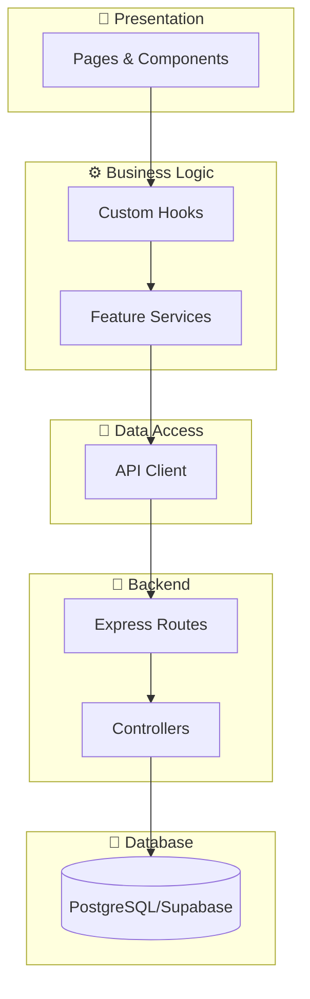

# UNEFA Dashboard — Sistema de Gestión Académica 🎓

[](https://github.com/Antony-Figueroa/UNEFA_DASHBOARD)
[](https://reactjs.org/)
[](https://www.typescriptlang.org/)
[](https://vitejs.dev/)
[](LICENSE.md)

**UNEFA Dashboard** es una plataforma integral de gestión académica diseñada para universidades, construida con tecnologías de vanguardia: **React 19**, **Tailwind CSS v4**, **Vite**, **Express** y **Supabase**. Proporciona una arquitectura robusta, escalable y optimizada para administración académica completa.

---

## ✨ Características Principales

### Gestión Académica
- 🎯 **Gestión Completa de Periodos Académicos** - Creación, edición y seguimiento de periodos con calendario dual
- 👨‍🎓 **Gestión de Estudiantes** - Administración completa con tipos civil/militar
- 👨‍🏫 **Gestión de Tutores** - Tutores académicos y sus asignaciones
- 🏢 **Gestión de Instituciones** - Empresas e instituciones asociadas
- 🎓 **Gestión de Carreras** - Programas académicos corta/larga duración

### Sistema de Pasantías
- 📝 **Pre-inscripciones e Inscripciones** - Proceso completo con validaciones
- 📊 **Seguimiento de Pasantías** - Tracking de visitas y actividades
- 📋 **Sistema de Evaluaciones** - 3 tipos ponderados (Institucional 40%, Académico 30%, Comité 30%)
- 📓 **Bitácora de Actividades** - Registro diario/semanal de estudiantes
- 📁 **Gestión de Documentos** - Cartas, informes, constancias

### Dashboards por Rol
- 👔 **Dashboard Admin** - Vista completa del sistema
- 👨‍🏫 **Dashboard Tutor** - Estudiantes asignados, seguimientos, evaluaciones
- 👨‍🎓 **Dashboard Estudiante** - Progreso de horas, bitácora, documentos, solicitudes

### Sistema y UX
- 🎨 **Personalización de Colores** - Cada usuario puede elegir su color de tema
- 🔔 **Notificaciones en Tiempo Real** - SSE para alertas instantáneas
- 🌙 **Dark Mode** - Soporte completo modo oscuro
- 🔐 **Autenticación Segura** - JWT con cookies HTTP-only
- 👥 **4 Roles de Usuario** - Admin, Asistente, Tutor, Estudiante

---

## 🚀 Quick Start

### Requisitos Previos

- **Node.js** >= 18.x
- **npm** >= 9.x
- **Cuenta de Supabase** (para base de datos PostgreSQL)
- **Docker** (opcional, para desarrollo con contenedores)

### Instalación Rápida

```bash
# 1. Clonar el repositorio
git clone https://github.com/Antony-Figueroa/UNEFA_DASHBOARD.git
cd UNEFA_DASHBOARD

# 2. Instalar dependencias
npm install                    # Frontend
cd backend && npm install      # Backend

# 3. Configurar variables de entorno
cp .env.example .env
cp backend/.env.example backend/.env
# Editar .env con credenciales de Supabase

# 4. Ejecutar migraciones en Supabase
# Ver carpeta backend/migrations/

# 5. Ejecutar en desarrollo
npm run dev              # Frontend en http://localhost:5173
cd backend && npm run dev # Backend en http://localhost:3000

# O con Docker:
docker-compose up --build
```

---

## 📂 Estructura del Proyecto

```text
UNEFA_DASHBOARD/
├── src/                    # Frontend React
│   ├── api/                # Cliente Axios y factories
│   ├── components/         # Componentes reutilizables
│   │   ├── ui/             # Componentes atómicos
│   │   ├── form/           # Componentes de formulario
│   │   ├── common/         # Componentes compartidos
│   │   └── Theme/          # Selector de colores
│   ├── features/           # Módulos por funcionalidad (20+ features)
│   │   ├── auth/           # Autenticación
│   │   ├── periods/        # Periodos académicos
│   │   ├── students/       # Estudiantes
│   │   ├── tutors/         # Tutores
│   │   ├── institutions/   # Instituciones
│   │   ├── careers/        # Carreras
│   │   ├── enrollment/     # Inscripciones
│   │   ├── tracking/       # Seguimiento
│   │   ├── evaluations/    # Evaluaciones
│   │   ├── activity-logs/  # Bitácora
│   │   ├── documents/      # Documentos
│   │   ├── student/        # Dashboard estudiante
│   │   ├── tutor/          # Dashboard tutor
│   │   ├── notifications/  # Notificaciones SSE
│   │   └── ...             # Otros features
│   ├── context/            # Contextos globales (Auth, Theme, Toast)
│   ├── pages/              # 40+ páginas
│   ├── routes/             # Definición de rutas
│   └── theme/              # Sistema de colores dinámico
│
├── backend/                # Backend Express
│   └── src/
│       ├── controllers/    # 18 controllers
│       ├── routes/         # 18 rutas
│       ├── middlewares/    # Auth, validation, error handling
│       ├── services/       # Lógica de negocio
│       ├── migrations/     # Migraciones SQL
│       └── lib/            # Cliente Supabase
│
├── docs/                   # Documentación
├── docker-compose.yml      # Docker
└── package.json
```

---

## 🛠️ Stack Tecnológico

### Frontend

| Tecnología | Versión | Propósito |
|------------|---------|-----------|
| **React** | 19.0.0 | Framework UI |
| **TypeScript** | 5.7.2 | Tipado estático |
| **Vite** | 6.1.0 | Build tool |
| **Tailwind CSS** | 4.1.18 | Estilos |
| **React Router** | 7.1.5 | Routing |
| **React Hook Form** | 7.69.0 | Formularios |
| **Zod** | 4.3.3 | Validación |
| **Axios** | 1.13.2 | Cliente HTTP |
| **ApexCharts** | 4.1.0 | Gráficos |
| **Lucide React** | 0.563.0 | Iconos |
| **Framer Motion** | 12.26.2 | Animaciones |

### Backend

| Tecnología | Versión | Propósito |
|------------|---------|-----------|
| **Node.js** | >= 18.x | Runtime |
| **Express** | 4.22.1 | Framework web |
| **TypeScript** | 5.x | Tipado |
| **Supabase JS** | 2.90.1 | Cliente PostgreSQL |
| **JWT** | - | Autenticación |
| **Multer** | - | Upload archivos |

### Infraestructura

- **Base de Datos**: PostgreSQL (Supabase)
- **Storage**: Supabase Storage (documentos)
- **Deployment**: Vercel (Frontend), Railway/Render (Backend)
- **Containers**: Docker + Docker Compose

---

## 🏗️ Arquitectura

### Feature-Based + Clean Architecture



### Flujo de Datos

1. **UI Components** → Eventos del usuario
2. **Pages** → Orquestación de features
3. **Hooks** → Estado y lógica de negocio
4. **Services** → Comunicación con API
5. **Backend Routes** → Recepción de requests
6. **Controllers** → Ejecución de lógica
7. **Supabase** → Persistencia

---

## 📚 Documentación

| Documento | Descripción |
|-----------|-------------|
| [**AGENTS.md**](AGENTS.md) | Guía completa para desarrolladores y agentes IA |
| [**docs/API.md**](docs/API.md) | Documentación de todos los endpoints |
| [**technical-specs.md**](technical-specs.md) | Sistema de colores y especificaciones UI |
| [**ux-standards.md**](ux-standards.md) | Estándares UX y accesibilidad |
| [**DOCKER_GUIDE.md**](DOCKER_GUIDE.md) | Guía Docker |
| [**CHANGELOG.md**](CHANGELOG.md) | Historial de cambios |

---

## 🎯 Comandos

```bash
# Desarrollo
npm run dev                  # Frontend
cd backend && npm run dev    # Backend

# Build
npm run build                # Frontend
cd backend && npm run build  # Backend

# Docker
docker-compose up --build    # Iniciar todo
docker-compose down          # Detener

# Testing
npm test                     # Tests
npm run lint                 # Lint
```

---

## 📝 Changelog Reciente

### [2.2.0] - 2026-02-20

#### Added
- ✨ **Sistema de personalización de colores** - Cada usuario elige su color de tema
- ✨ **Bitácora de actividades** - Registro diario/semanal para estudiantes
- ✨ **Progreso de horas** - Barra visual de horas completadas vs requeridas
- ✨ **Sistema de documentos** - Upload de cartas, informes, constancias
- ✨ **Notificaciones SSE** - Sistema de notificaciones en tiempo real
- ✨ **Sistema de solicitudes** - Estudiantes pueden enviar solicitudes a coordinación

#### Changed
- 🔄 Dashboard de estudiante completamente rediseñado
- 🔄 Mejoras en sidebar con indicador de menú activo
- 🔄 Optimización de chunks para mejor rendimiento

### [2.1.0] - 2026-02-19

#### Added
- ✨ Sistema de Evaluaciones de Prácticas (3 tipos ponderados)
- ✨ Roles de TUTOR y ESTUDIANTE con dashboards dedicados

---

## 🔐 Seguridad

- ✅ JWT con HttpOnly Cookies
- ✅ CORS configurado
- ✅ Helmet headers
- ✅ Bcrypt hash
- ✅ Validación Zod
- ✅ Row Level Security (Supabase)

---

## 🤝 Contribución

1. Fork del proyecto
2. Crear rama feature (`git checkout -b feature/AmazingFeature`)
3. Commit (`git commit -m 'Add: AmazingFeature'`)
4. Push (`git push origin feature/AmazingFeature`)
5. Abrir Pull Request

**Convenciones:**
- Commits: [Conventional Commits](https://www.conventionalcommits.org/)
- TypeScript: Tipado estricto
- Código: Ver [AGENTS.md](AGENTS.md)

---

## 📄 Licencia

MIT License - ver [LICENSE.md](LICENSE.md)

---

## 👥 Autor

- **Antony Figueroa** - [GitHub](https://github.com/Antony-Figueroa)

---

**⭐ Si este proyecto te resulta útil, considera darle una estrella**
