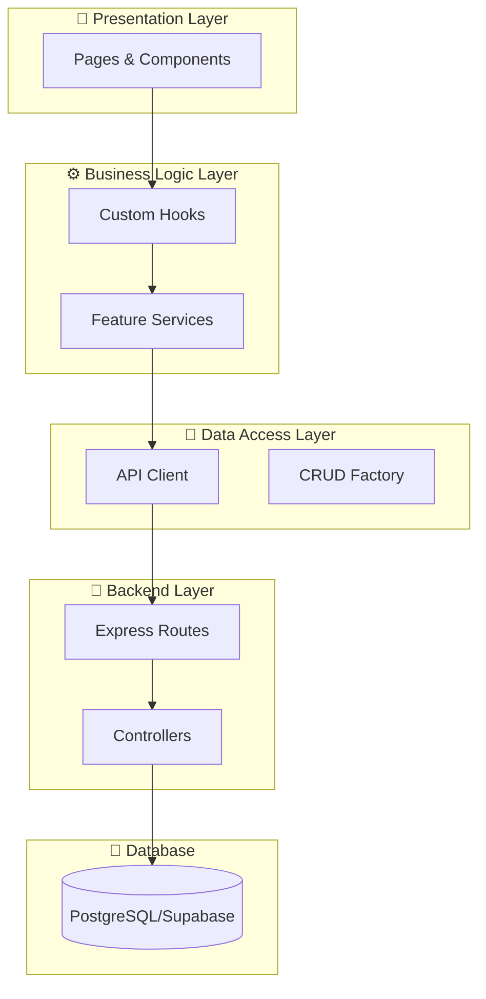

# UNEFA Dashboard — Sistema de Gestión Académica 🎓

[](https://github.com/Antony-Figueroa/UNEFA_DASHBOARD)
[](https://reactjs.org/)
[](https://www.typescriptlang.org/)
[](https://vitejs.dev/)
[](LICENSE.md)

**UNEFA Dashboard** es una plataforma integral de gestión académica diseñada para universidades, construida con tecnologías de vanguardia: **React 19**, **Tailwind CSS v4**, **Vite**, **Express** y **Supabase**. Proporciona una arquitectura robusta, escalable y optimizada para administración académica completa.

## ✨ Características Principales

- 🎯 **Gestión Completa de Periodos Académicos** - Creación, edición y seguimiento de periodos
- 👨‍🎓 **Gestión de Estudiantes y Tutores** - Administración completa de perfiles y asignaciones
- 🏢 **Gestión de Instituciones** - Control de instituciones asociadas y responsables
- 📝 **Sistema de Inscripciones** - Pre-inscripciones e inscripciones con validaciones
- 📊 **Seguimiento de Pasantías** - Tracking completo de visitas y actividades
- 🎓 **Gestión de Carreras** - Administración de programas académicos
- 👥 **Sistema de Usuarios y Roles** - Control de acceso basado en roles
- 📈 **Dashboard Analítico** - Visualización de estadísticas y métricas
- 🎨 **Sistema de Diseño Moderno** - UI/UX premium con dark mode
- 🔐 **Autenticación Segura** - JWT con cookies HTTP-only

---

## 🚀 Quick Start

### Requisitos Previos

- **Node.js** >= 18.x
- **npm** >= 9.x
- **Cuenta de Supabase** (para base de datos PostgreSQL)
- **Docker** (opcional, para desarrollo con contenedores)

### Instalación Rápida

```bash
# 1. Clonar el repositorio
git clone https://github.com/Antony-Figueroa/UNEFA_DASHBOARD.git
cd UNEFA_DASHBOARD

# 2. Instalar dependencias del frontend
npm install

# 3. Instalar dependencias del backend
cd backend && npm install && cd ..

# 4. Configurar variables de entorno
# Copiar archivos de ejemplo
cp .env.example .env
cp backend/.env.example backend/.env

# 5. Editar .env con tus credenciales de Supabase
# Frontend (.env):
#   VITE_SUPABASE_URL=tu_url_supabase
#   VITE_SUPABASE_ANON_KEY=tu_anon_key
#
# Backend (backend/.env):
#   SUPABASE_URL=tu_url_supabase
#   SUPABASE_SERVICE_ROLE_KEY=tu_service_role_key
#   PORT=3000
#   JWT_SECRET=tu_secret_seguro

# 6. Ejecutar en desarrollo
npm run dev              # Frontend en http://localhost:5173
cd backend && npm run dev # Backend en http://localhost:3000

# O con Docker (todo el sistema):
docker-compose up --build
```

---

## 📂 Estructura del Proyecto

```text
UNEFA_DASHBOARD/
├── src/                    # Frontend React
│   ├── api/                # Cliente API (Axios) y factories
│   ├── components/         # Componentes reutilizables
│   │   ├── ui/             # Componentes atómicos (Button, Input, etc.)
│   │   ├── form/           # Componentes de formulario
│   │   └── common/         # Componentes compartidos
│   ├── features/           # Módulos por funcionalidad (16 features)
│   │   ├── auth/           # Autenticación
│   │   ├── periods/        # Periodos académicos
│   │   ├── careers/        # Carreras
│   │   ├── students/       # Estudiantes
│   │   ├── enrollment/     # Inscripciones
│   │   └── ...             # Otros features
│   ├── context/            # Contextos globales (Auth, Theme)
│   ├── pages/              # Páginas de la aplicación
│   ├── routes/             # Definición de rutas
│   └── utils/              # Utilidades compartidas
│
├── backend/                # Backend Express
│   └── src/
│       ├── controllers/    # Lógica de negocio (14 controllers)
│       ├── routes/         # Definición de endpoints
│       ├── middlewares/    # Middlewares (auth, validation)
│       ├── services/       # Servicios (email, etc.)
│       └── lib/            # Utilidades y cliente Supabase
│
├── public/                 # Assets estáticos
├── docs/                   # Documentación del proyecto
├── docker-compose.yml      # Orquestación de contenedores
└── package.json            # Dependencias y scripts
```

---

## 🛠️ Tecnologías Principales

### Frontend

| Tecnología | Versión | Propósito |
|------------|---------|-----------|
| **React** | 19.0.0 | Framework UI |
| **TypeScript** | 5.7.2 | Tipado estático |
| **Vite** | 6.1.0 | Build tool y dev server |
| **Tailwind CSS** | 4.1.18 | Framework de estilos |
| **React Router** | 7.1.5 | Routing |
| **React Hook Form** | 7.69.0 | Gestión de formularios |
| **Zod** | 4.3.3 | Validación de esquemas |
| **Axios** | 1.13.2 | Cliente HTTP |
| **ApexCharts** | 4.1.0 | Gráficos y visualizaciones |
| **Lucide React** | 0.563.0 | Iconografía |
| **Framer Motion** | 12.26.2 | Animaciones |
| **React Hot Toast** | 2.6.0 | Notificaciones |

### Backend

| Tecnología | Versión | Propósito |
|------------|---------|-----------|
| **Node.js** | >= 18.x | Runtime JavaScript |
| **Express** | 4.22.1 | Framework web |
| **TypeScript** | 5.x | Tipado estático |
| **Supabase JS** | 2.90.1 | Cliente PostgreSQL |
| **JWT** | - | Autenticación |
| **Bcrypt** | - | Hash de contraseñas |
| **Helmet** | 8.1.0 | Seguridad HTTP |
| **CORS** | 2.8.5 | Control de acceso |

### Infraestructura

- **Base de Datos**: PostgreSQL (Supabase)
- **Deployment**: Vercel (Frontend), Railway/Render (Backend)
- **Contenedores**: Docker + Docker Compose
- **Analytics**: Vercel Analytics

---

## 🏗️ Arquitectura del Sistema

El sistema implementa una **Arquitectura Basada en Características (Feature-Based)** combinada con principios de **Clean Architecture**.

### Capas Principales



> [!NOTE]
> Para un análisis profundo de la arquitectura, consulta [analisis_arquitectonico.md](file:///C:/Users/Server%20Admin/.gemini/antigravity/brain/dfdf19b2-b679-41e5-8b88-5807eeb8b79c/analisis_arquitectonico.md) en la carpeta Brain.

---

## 📚 Documentación

### Guías Disponibles

| Documento | Descripción |
|-----------|-------------|
| [**AGENTS.md**](AGENTS.md) | Guía completa para desarrolladores y agentes de IA |
| [**README_TECNICO.md**](README_TECNICO.md) | Especificaciones técnicas detalladas |
| [**technical-specs.md**](technical-specs.md) | Especificaciones de diseño y sistema de colores |
| [**ux-standards.md**](ux-standards.md) | Estándares de UX y accesibilidad |
| [**DOCKER_GUIDE.md**](DOCKER_GUIDE.md) | Guía completa de Docker y troubleshooting |
| [**CHANGELOG.md**](CHANGELOG.md) | Historial de cambios del proyecto |

---

## 🎯 Comandos Útiles

```bash
# Desarrollo
npm run dev                  # Iniciar frontend (puerto 5173)
cd backend && npm run dev    # Iniciar backend (puerto 3000)

# Build
npm run build                # Compilar frontend para producción
cd backend && npm run build  # Compilar backend para producción

# Docker
docker-compose up            # Iniciar servicios
docker-compose up --build    # Reconstruir e iniciar
docker-compose down          # Detener servicios

# Testing
npm test                     # Ejecutar tests
npm run lint                 # Verificar código

# Otros
npm run preview              # Vista previa de build de producción
npm run storybook            # Iniciar Storybook (componentes UI)
```

---

## 🔐 Seguridad

### Medidas Implementadas

- ✅ **JWT con HttpOnly Cookies** - Tokens seguros en cookies
- ✅ **CORS Configurado** - Control de orígenes permitidos
- ✅ **Helmet** - Headers de seguridad HTTP
- ✅ **Bcrypt** - Hash seguro de contraseñas
- ✅ **Validación de Entrada** - Zod schemas en frontend y backend
- ✅ **Row Level Security** - Políticas en Supabase
- ✅ **Docker Read-Only** - Archivos .env protegidos

---

## 📝 Changelog (Últimas Actualizaciones)

### [2.0.2] - 2026-02-15

#### Added
- ✨ Documentación completa del sistema actualizada
- ✨ Análisis arquitectónico comprehensive
- ✨ Guías mejoradas para desarrolladores

#### Changed
- 🔄 Mejora en estructura de documentación
- 🔄 Actualización de badges y versiones en README

#### Documentation
- 📚 README.md completamente renovado
- 📚 AGENTS.md actualizado con nuevos patrones
- 📚 Documentación técnica mejorada

### Versiones Anteriores

Para ver el historial completo de cambios, consulta [CHANGELOG.md](CHANGELOG.md).

---

## 🤝 Contribución

1. **Fork del proyecto**
2. **Crear rama de feature** (`git checkout -b feature/AmazingFeature`)
3. **Commit de cambios** (`git commit -m 'Add: AmazingFeature'`)
4. **Push a la rama** (`git push origin feature/AmazingFeature`)
5. **Abrir Pull Request**

### Convenciones

- **Commits**: Seguir [Conventional Commits](https://www.conventionalcommits.org/)
- **TypeScript**: Tipado estricto, evitar `any`
- **Código**: Seguir guías en [AGENTS.md](AGENTS.md)

---

## 📄 Licencia

Este proyecto está bajo la Licencia MIT - ver [LICENSE.md](LICENSE.md) para detalles.

---

## 👥 Autores

- **Antony Figueroa** - [GitHub](https://github.com/Antony-Figueroa)

---

## 🙏 Agradecimientos

- React Team por React 19
- Vercel por Vite y alojamiento
- Supabase por la infraestructura de base de datos
- La comunidad open source

---

**⭐ Si este proyecto te resulta útil, considera darle una estrella en GitHub**

