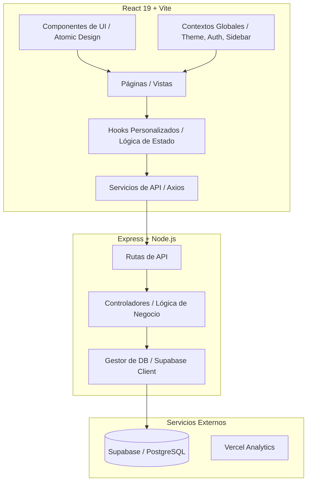
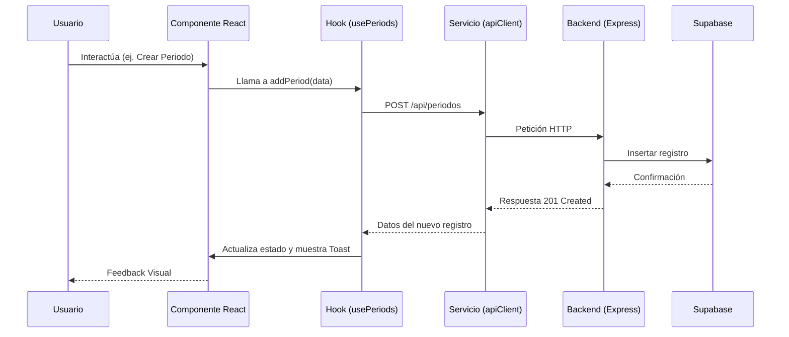

# Proyecto-Unefa — Sistema de Gestión Académica (Admin Dashboard)

Proyecto-Unefa es una plataforma integral de gestión académica construida con tecnologías de vanguardia: **React 19**, **Tailwind CSS v4**, **Vite** y **Supabase**. Esta plantilla proporciona una arquitectura robusta, escalable y optimizada para aplicaciones SaaS y paneles de administración modernos.

---

## 🚀 Análisis de Arquitectura y Lógica de Negocio

### 1. Arquitectura del Sistema
El sistema sigue un patrón de **Arquitectura de Capas** y **Módulos basados en Características (Feature-based)**, lo que facilita el mantenimiento y la escalabilidad.

#### Diagrama de Componentes


### 2. Flujo de Datos y Lógica de Negocio
La lógica de negocio se centraliza en la capa de **Hooks** y **Servicios** en el frontend, y en los **Controladores** en el backend.

#### Diagrama de Flujo Principal (CRUD de Periodos/Carreras)


---

## 📂 Estructura del Proyecto

### Organización de Directorios
```text
src/
├── api/                # Cliente API centralizado (Axios)
├── components/         # Componentes reutilizables (UI, Form, Common)
├── context/            # Proveedores de estado global (Theme, Sidebar, Toast)
├── features/           # Módulos por funcionalidad (Periods, Careers, Students, etc.)
│   ├── components/     # Componentes específicos de la feature
│   ├── hooks/          # Lógica de estado y side-effects
│   ├── services/       # Llamadas a API específicas
│   └── types/          # Definiciones de TypeScript
├── layout/             # Estructura visual base (Header, Sidebar, Layout)
├── pages/              # Páginas de la aplicación (Orquestadores de features)
├── routes/             # Configuración de rutas modularizada (React.lazy)
└── lib/                # Librerías externas (Supabase Client)

backend/
├── src/
│   ├── controllers/    # Lógica de negocio del servidor
│   ├── routes/         # Definición de endpoints
│   └── lib/            # Utilidades y conexión a DB (Supabase)
```

---

## 🛠️ Guía de Configuración y Despliegue

### Requisitos del Sistema
- **Node.js**: >= 18.x
- **NPM**: >= 9.x
- **Docker**: (Opcional) para contenedores.
- **Supabase Account**: Para la base de datos.

### Clonación y Configuración
1. **Clonar el repositorio**:
   ```bash
   git clone https://github.com/tu-usuario/proyecto-unefa.git
   cd proyecto-unefa
   ```

2. **Configurar Variables de Entorno**:
   Crea un archivo `.env` en la raíz y otro en `/backend`:
   
   **Frontend (.env)**:
   ```env
   VITE_SUPABASE_URL=tu_url_supabase
   VITE_SUPABASE_ANON_KEY=tu_anon_key
   ```

   **Backend (backend/.env)**:
   ```env
   SUPABASE_URL=tu_url_supabase
   SUPABASE_SERVICE_ROLE_KEY=tu_service_role_key
   PORT=3000
   ```

3. **Instalar Dependencias**:
   ```bash
   npm install
   cd backend && npm install
   ```

4. **Ejecución en Desarrollo**:
   - **Frontend**: `npm run dev` (Acceso en `http://localhost:5173`)
   - **Backend**: `cd backend && npm run dev` (Acceso en `http://localhost:3000`)

### Uso con Docker
El sistema incluye soporte para Docker Compose, facilitando la ejecución de ambos entornos simultáneamente.
```bash
docker-compose up --build
```

---

## 📈 Tecnologías Principales
- **Frontend**: React 19, Vite, Tailwind CSS v4, React Router 7, React Hook Form, Zod.
- **Backend**: Node.js, Express, TypeScript, Helmet, CORS.
- **Base de Datos**: Supabase (PostgreSQL).
- **Despliegue**: Optimizado para Vercel (Frontend) y servicios de Node.js (Backend).

---

## 📝 Changelog (Últimas Optimizaciones)
- **Modularización de Rutas**: Se migró la lógica de enrutamiento de `App.tsx` a `src/routes/index.tsx` utilizando `React.lazy` para mejorar el rendimiento.
- **Refactorización de Código**: Aplicación de principios SOLID en hooks y servicios de características.
- **Limpieza de Documentación**: Eliminación de archivos `.md` redundantes y consolidación en este README.
- **Actualización de Dependencias**: Core libraries actualizadas a sus versiones más estables compatibles con React 19.
- **Integración de Vercel Analytics**: Reactivado para monitoreo de rendimiento en producción.
- **Mejora en Docker**: Configuración optimizada para desarrollo ágil con HMR.

---

## 📄 Licencia
Este proyecto está bajo la Licencia MIT.
