# 🏛️ Arquitectura del Sistema UNEFA Dashboard

> **Guía explicativa para la exposición** — conceptos, analogías y paso a paso sin código
> Pensada para que cualquier persona, sin ser programadora, entienda cómo funciona este sistema por dentro.

---

## 📋 Tabla de Contenidos

1. [¿Qué es UNEFA Dashboard?](#1-qué-es-unefa-dashboard)
2. [La Gran Analogía: El Sistema como una Universidad](#2-la-gran-analogía-el-sistema-como-una-universidad)
3. [Los 3 Grandes Componentes](#3-los-3-grandes-componentes)
4. [El Viaje de un Clic: Paso a Paso](#4-el-viaje-de-un-clic-paso-a-paso)
5. [El Carnet de Identidad (Autenticación)](#5-el-carnet-de-identidad-autenticación)
6. [¿Dónde Vive el Sistema? (Entornos)](#6-dónde-vive-el-sistema-entornos)
7. [Los 3 Modos de Operación](#7-los-3-modos-de-operación)
8. [Patrones de Diseño Explicados con Analogías](#8-patrones-de-diseño-explicados-con-analogías)
9. [Seguridad: Candados y Guardias](#9-seguridad-candados-y-guardias)
10. [Glosario Visual Rápido](#10-glosario-visual-rápido)

---

## 1. ¿Qué es UNEFA Dashboard?

**UNEFA Dashboard** es un sistema de gestión académica. Su trabajo es ayudar a administrar todo lo que pasa en una universidad:

- Estudiantes, profesores, tutores
- Carreras, periodos académicos, materias
- Inscripciones y pre-inscripciones
- Pasantías (seguimiento, evaluaciones, culminación)
- Documentos, reportes, notificaciones
- Roles y permisos (quién puede hacer qué)

Imaginemos que la universidad tiene un **edificio administrativo** lleno de oficinas. UNEFA Dashboard es la versión digital de ese edificio: las ventanillas, los archivadores, los mensajeros internos y los departamentos, todo funcionando como un solo sistema.

---

## 2. La Gran Analogía: El Sistema como una Universidad

Cada parte técnica del sistema tiene un **equivalente en el mundo universitario real**. Esta analogía nos va a acompañar durante toda la explicación:

| Concepto Técnico | 🏛️ Analogía Universitaria |
|-----------------|---------------------------|
| **Frontend** (lo que ves en pantalla) | La **cartelera de anuncios**, las **ventanillas de atención** y los **formularios** que llenás cuando hacés un trámite |
| **Backend** (el servidor) | El **edificio administrativo** lleno de oficinas donde procesan los trámites |
| **Base de Datos** | El **archivo central**: todos los expedientes de estudiantes, profesores, notas, etc. |
| **Router** (direccionador) | El **mensajero interno** que agarra un formulario y lo lleva a la oficina correcta |
| **Controller** (controlador) | El **jefe de departamento** que recibe el formulario, lo lee y decide qué hacer |
| **Service** (servicio) | El **especialista** que ejecuta el trámite (el de Registro, el de Tesorería, etc.) |
| **Middleware** (interceptor) | El **guardia de seguridad** en la entrada que revisa tu carnet antes de dejarte pasar |
| **JWT** (token de identidad) | El **carnet universitario** con tu foto, cédula, carrera y semestre |
| **API** (interfaz de comunicación) | Los **formularios y oficios oficiales** que viajan entre ventanillas y oficinas |
| **Singleton** (instancia única) | La **única fotocopiadora del edificio** — todos pasan por la misma |
| **Base de datos online** (Supabase) | El **archivo central en la sede principal** |
| **Base de datos local** (PGlite) | Tu **carpeta personal con copias** de los documentos que más usás |
| **Notificaciones SSE** | El **altavoz del pasillo** que anuncia: "El profesor X ha publicado las notas" |

> 💡 **Para la expo:** Podés arrancar mostrando esta tabla y decir _"imaginen que el sistema ES una universidad, pero digital"_. Esto le da al público un marco mental para todo lo que sigue.

---

## 3. Los 3 Grandes Componentes

El sistema se divide en **3 partes principales**. Siempre que pasa algo, estas 3 partes trabajan juntas.

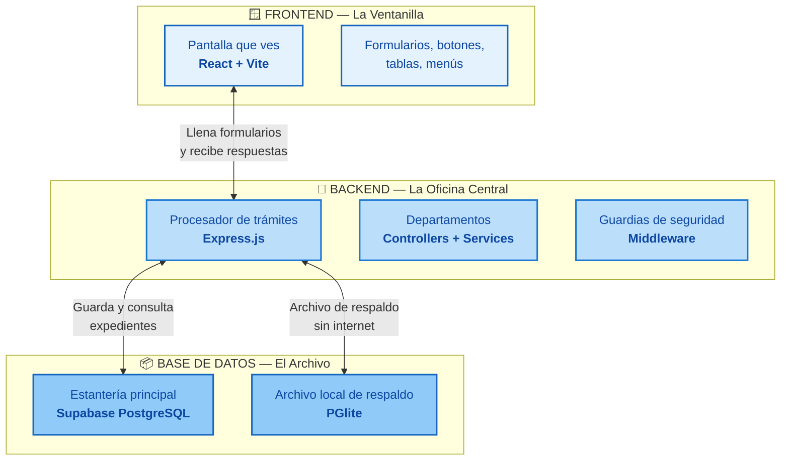

### 3.1. Frontend — "La Ventanilla" 🪟

**¿Qué es?** Es todo lo que el usuario ve y toca en la pantalla. Cuando un estudiante inicia sesión, ve su dashboard, carga sus documentos, busca materias... todo eso es el Frontend.

**¿Cómo se hizo?** Usa algo llamado **React**, que es como un juego de Lego: cada pieza de la interfaz (un botón, una tabla, un menú) es una pieza independiente que se puede reutilizar. El sistema tiene **41 módulos** (como cajones de un archivador), cada uno con su propia ventanilla.

**Lo importante:**
- Corre en el **navegador web** (Chrome, Edge, etc.) o en la **app de escritorio** (Electron)
- No guarda información permanente — solo muestra lo que obtiene del Backend
- Si el Backend no responde, muestra un mensaje de error amigable

### 3.2. Backend — "La Oficina Central" 🏢

**¿Qué es?** El cerebro del sistema. Vive en un servidor en internet (Render.com). Recibe las solicitudes del Frontend, las procesa, consulta la Base de Datos, y devuelve los resultados.

**¿Qué tiene adentro?**

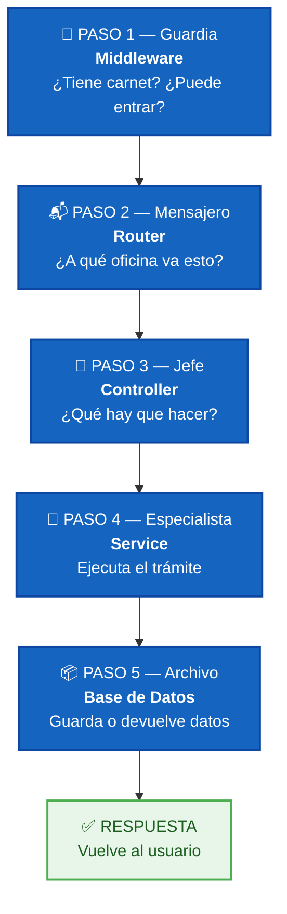

**Lo importante:**
- Tiene **51 tipos de formularios** (rutas) que sabe procesar
- Tiene **49 jefes de departamento** (controllers)
- Tiene **43 especialistas** (services)
- Corre 24/7 esperando solicitudes

### 3.3. Base de Datos — "El Archivo Central" 📦

**¿Qué es?** Donde se guarda **toda** la información: estudiantes, profesores, notas, inscripciones, documentos, configuraciones, etc.

**¿Qué tecnología usa?** **PostgreSQL** (a través de Supabase). Es uno de los motores de base de datos más usados del mundo. Piensen en Excel, pero para sistemas enormes, con capacidad de buscar entre millones de registros en milisegundos.

**¿Cómo está organizada?** Tiene muchas **tablas** (como hojas de cálculo), cada una con un propósito:

| Tabla | Guarda... |
|-------|-----------|
| `students` | Datos de cada estudiante |
| `careers` | Carreras disponibles |
| `periods` | Periodos académicos |
| `enrollments` | Inscripciones |
| `users` | Quién puede entrar al sistema |
| Y +80 tablas más... | |

**Lo importante:**
- La base de datos **NO está** en el Frontend ni en el Backend — es un servicio aparte
- El Backend es el **único** que puede hablar con la Base de Datos
- El Frontend **NUNCA** se conecta directo a la Base de Datos (imaginate un estudiante entrando al archivo central a buscar su expediente solo — no puede, tiene que pedirlo en ventanilla)

> 💡 **Para la expo:** Mostrá los 3 componentes como 3 edificios separados. El Frontend es la ventanilla donde el usuario habla. El Backend es la oficina donde procesan. La Base de Datos es el archivo en otro piso. Nunca se saltan el orden.

---

## 4. El Viaje de un Clic: Paso a Paso

Vamos a seguir el camino que hace **un solo clic** desde que el usuario toca un botón hasta que ve el resultado en pantalla.

### Escenario: Un coordinador quiere ver la lista de estudiantes

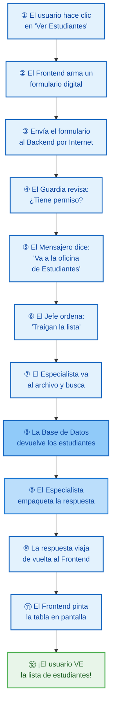

**Tiempo total:** Todo esto pasa en **menos de 1 segundo** cuando funciona bien.

### Desglose visual del viaje:

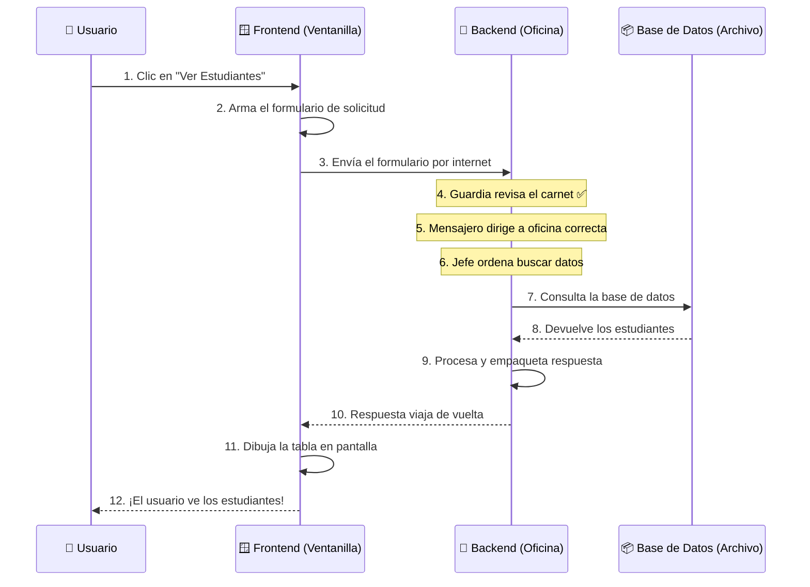

> 💡 **Para la expo:** Este diagrama de secuencia es perfecto para proyectarlo y explicar paso a paso. Podés señalar cada número mientras lo contás.

### ¿Y si falla algo?

El sistema está preparado para cuando las cosas salen mal:

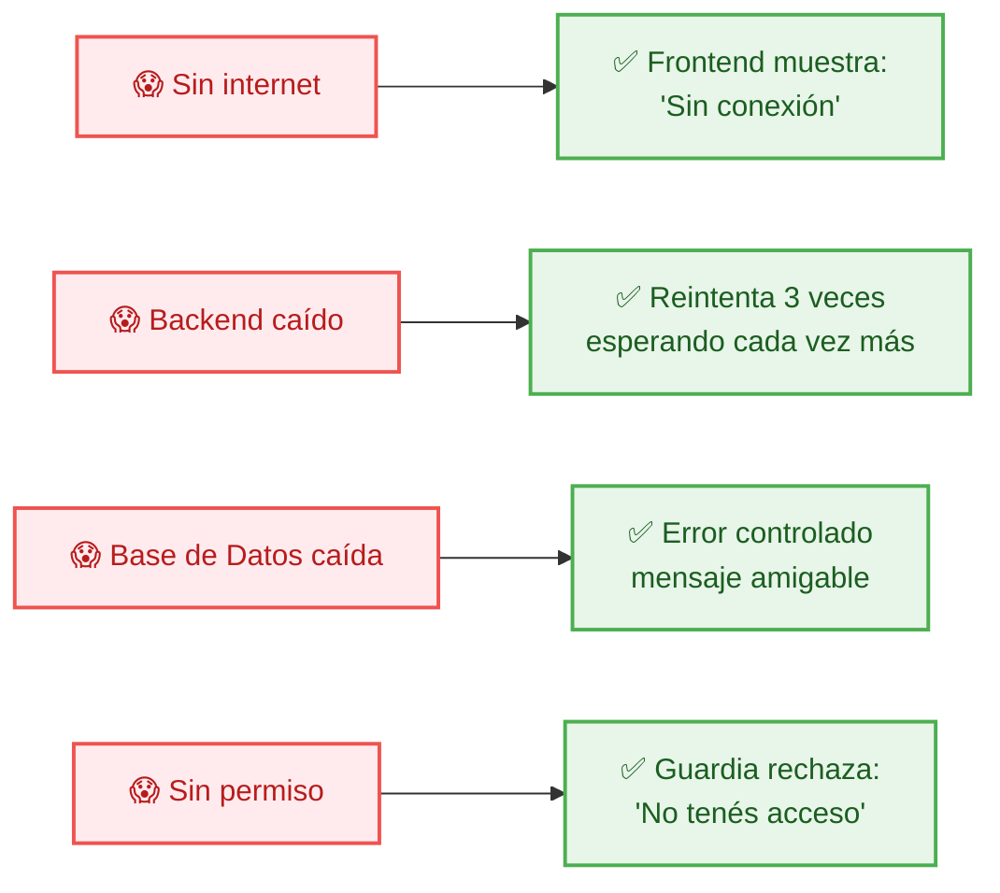

---

## 5. El Carnet de Identidad (Autenticación)

### ¿Cómo sabe el sistema quién soy?

Cada vez que un usuario **inicia sesión**, el sistema le entrega un **carnet digital** llamado **JWT** (se pronuncia "yeiti-doblu"). Este carnet es como el carnet universitario:

```
┌─────────────────────────────────┐
│                                 │
│      🏛️ UNEFA DASHBOARD        │
│                                 │
│  Nombre:   María Pérez          │
│  Rol:      Coordinadora         │
│  Carrera:  Ing. Sistemas        │
│  Vence:    24 horas             │
│                                 │
│  [Sello digital firmado]        │
│                                 │
└─────────────────────────────────┘
```

**¿Qué tiene adentro?**
- Quién es el usuario
- Qué rol tiene (estudiante, coordinador, administrador)
- Hasta cuándo es válido (24 horas)

### El proceso de inicio de sesión, paso a paso:

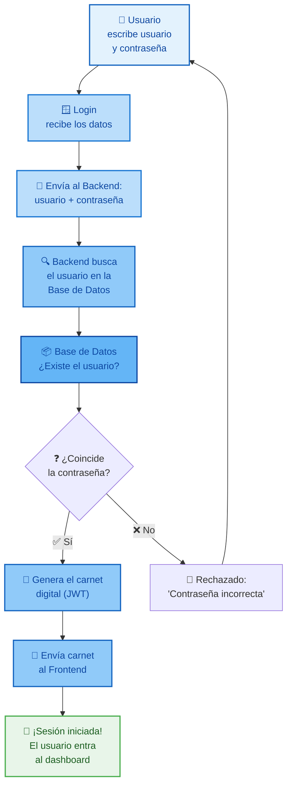

### El Guardia revisa el carnet en cada solicitud

Una vez que el usuario tiene su carnet, **cada vez** que hace clic en algo, el Frontend lo muestra automáticamente:

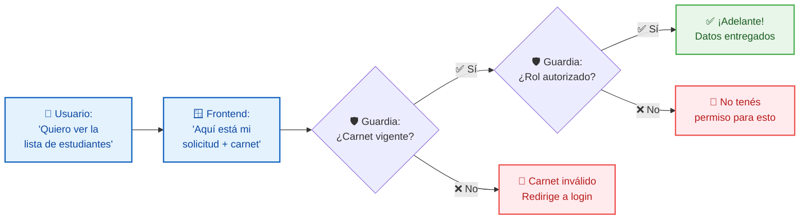

### ¿Por qué es importante?

- **Seguridad**: Nadie puede hacerse pasar por otro usuario
- **Control de acceso**: Un estudiante no puede ver cosas de coordinadores
- **Trazabilidad**: El sistema sabe QUIÉN hizo cada acción (quién inscribió, quién modificó notas)

> 💡 **Para la expo:** Mostrá el carnet como un carnet universitario físico. La gente entiende al toque. Después explicá que el "sello digital" es una firma matemática que el sistema puede verificar sin necesidad de llamar a la oficina central cada vez.

---

## 6. ¿Dónde Vive el Sistema? (Entornos)

El sistema no está todo en una sola computadora. Está distribuido en **3 lugares diferentes** que se comunican entre sí:

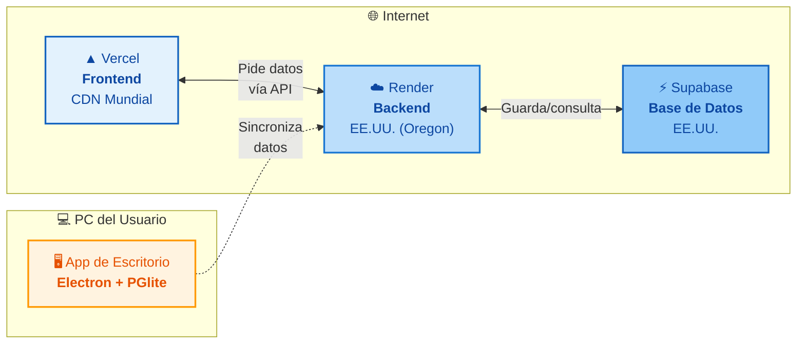

### 6.1. Vercel — El Frontend Mundial 🌍

**¿Qué es?** Vercel es una empresa que se dedica a servir páginas web rápido desde cualquier parte del mundo.

**¿Qué hace?** Guarda el Frontend y lo distribuye a través de una **CDN** (Red de Distribución de Contenido). Imaginate que el Frontend está fotocopiado en servidores por todo el mundo. Cuando un usuario en Venezuela entra al sistema, la copia más cercana se la muestra. Así es **rápido**.

**Dato curioso:** Vercel está optimizado para frontends hechos con React y Vite. Detecta automáticamente que nuestro proyecto usa esas tecnologías y lo configura solo.

### 6.2. Render — El Backend Central 🏢

**¿Qué es?** Render es donde vive el Backend (la Oficina Central). Es un servidor que está encendido 24/7 esperando solicitudes.

**¿Dónde está físicamente?** En Oregon, EE.UU.

**¿Por qué no está todo en Vercel?** Porque Vercel está diseñado para páginas web estáticas rápidas, NO para servidores que necesitan estar siempre encendidos procesando solicitudes. Render sí está diseñado para eso.

### 6.3. Supabase — La Base de Datos en la Nube ☁️

**¿Qué es?** Supabase es un servicio que ofrece bases de datos PostgreSQL listas para usar.

**¿Dónde está?** También en EE.UU.

**Ventajas de usar Supabase:**
- **PostgreSQL puro**: El motor de base de datos más potente y confiable
- **API incluida**: Tiene herramientas extra útiles
- **Escalable**: Crece con el sistema

### El puente Vercel → Render (Proxy Inverso)

Cuando el Frontend (en Vercel) necesita hablar con el Backend (en Render), no lo hace directamente porque tienen **direcciones diferentes**. Necesitan un **recepcionista**:

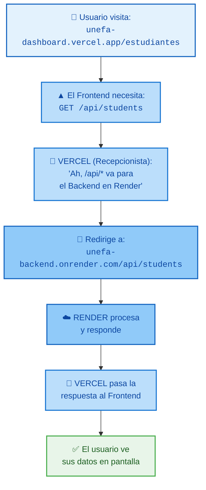

Esto se llama un **proxy inverso**. Es como el recepcionista de un edificio que recibe a los visitantes y los dirige a la oficina correcta.

---

## 7. Los 3 Modos de Operación

El sistema puede funcionar de **3 maneras diferentes** según cómo se use:

### Modo 1: Cloud ☁️ (Usuarios web normales)

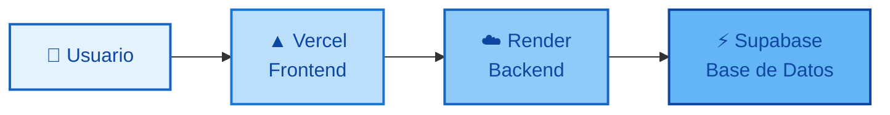

**Cuándo se usa:** Cuando alguien entra desde cualquier navegador web.

**Ventaja:** No necesita instalar nada. Abre el navegador y ya.

**Desventaja:** Necesita internet para funcionar.

### Modo 2: Offline/Desktop 💻 (App de Escritorio)

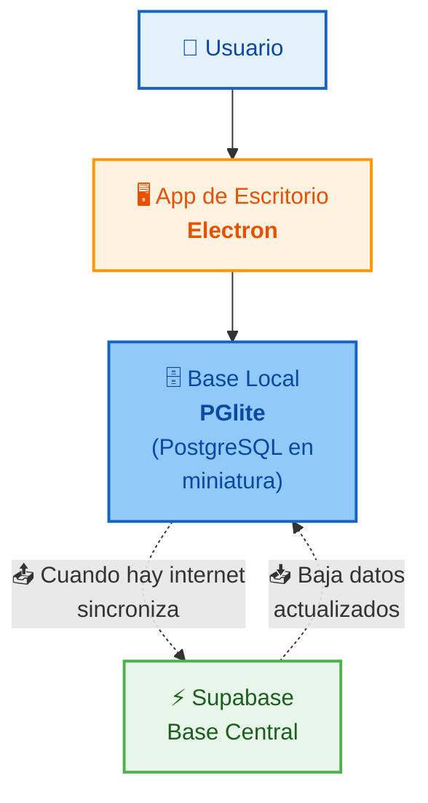

**Cuándo se usa:** Cuando el usuario instala la aplicación en su computadora (Windows).

**¿Cómo funciona?** La app incluye todo lo necesario para funcionar SIN internet:
- Tiene el Frontend adentro
- Tiene un **mini Backend** empaquetado
- Tiene una **base de datos local** (PGlite) que es una versión en miniatura de PostgreSQL

**Sincronización:** Cuando hay internet, la app se conecta con Supabase y baja los datos más recientes. También sube los cambios que se hicieron sin conexión.

**Analogía:** Es como tener una copia del archivo central en tu oficina. Cuando hay internet, actualizás la carpeta. Cuando no hay, trabajás con tu copia local.

### Modo 3: Docker 🐳 (Desarrollo/Despliegue completo)

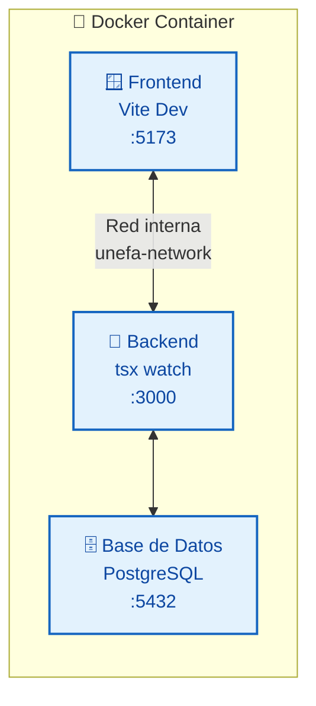

**Cuándo se usa:** Cuando un programador quiere ejecutar TODO el sistema en su computadora para desarrollar o probar.

**Docker** es como una máquina virtual portátil que empaqueta el Frontend, Backend y Base de Datos en un solo contenedor que funciona en cualquier computadora.

> 💡 **Para la expo:** Los 3 modos se explican bien con un diagrama de cajitas. Mostrá que el Modo Online tiene 3 servidores separados, el Offline tiene todo en la PC, y Docker tiene todo en un contenedor.

---

## 8. Patrones de Diseño Explicados con Analogías

Los patrones de diseño son **soluciones comprobadas a problemas comunes** en programación. Acá están los que usa este sistema, explicados sin código.

### 8.1. Singleton — "La Única Fotocopiadora" 📠

**Problema:** Muchas oficinas necesitan fotocopiar documentos. Si cada oficina compra su propia fotocopiadora, gastan plata al pedo y ocupan espacio.

**Solución:** Comprar **UNA sola fotocopiadora** para todo el edificio. Todos pasan por la misma.

**En el sistema:** El **DatabaseManager** es la única fotocopiadora. Cada vez que alguien necesita hablar con la base de datos, pasa por el mismo DatabaseManager.

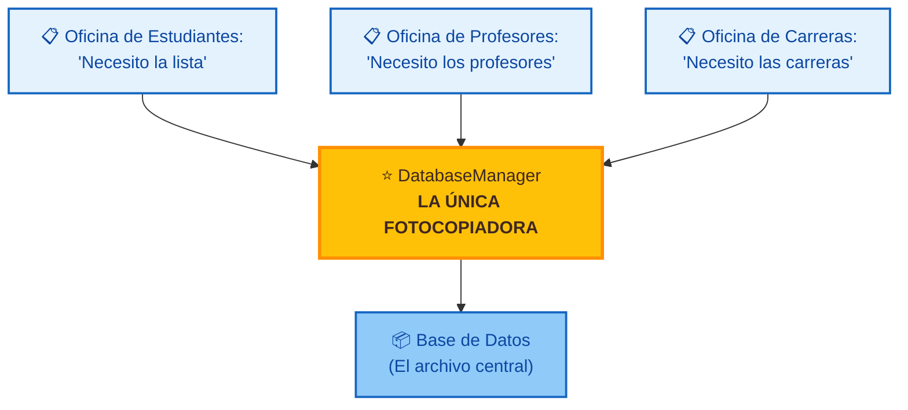

**Resultado:**
- Usamos UNA sola conexión a la base de datos
- Ahorramos recursos
- Garantizamos que todos hablen con la misma fuente de verdad

### 8.2. Adaptador/Strategy — "El Traductor" 🌐

**Problema:** El sistema necesita funcionar tanto en la nube (con Supabase) como sin internet (con PGlite local). Son dos sistemas diferentes, como alguien que habla inglés y otro que habla español.

**Solución:** Contratar un **traductor** que hable ambos idiomas. Le decís lo que necesitás y él lo pide en el idioma correcto.

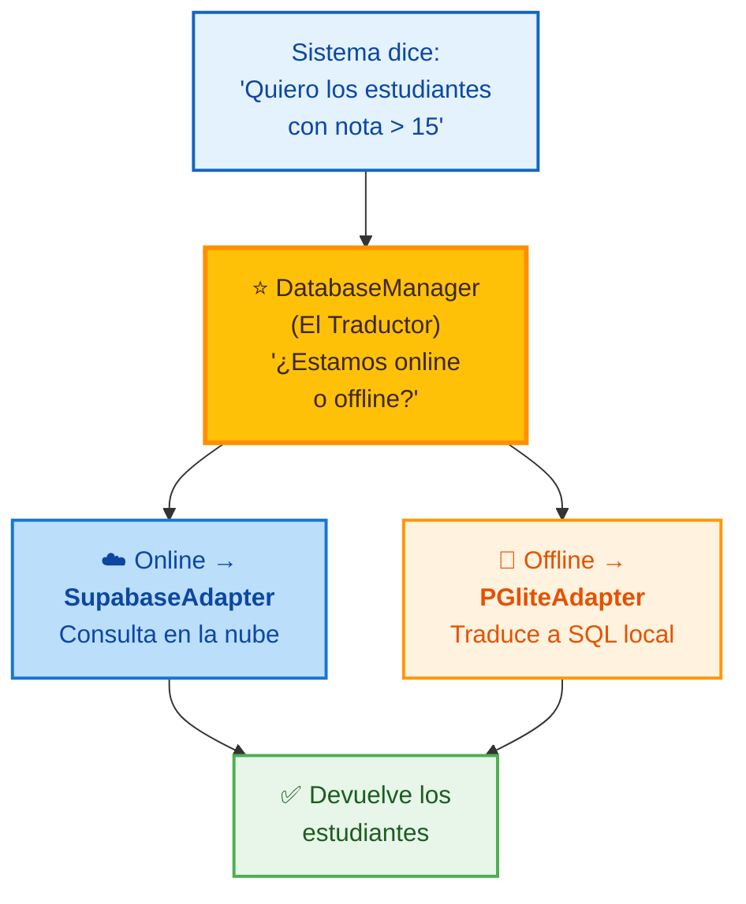

**Ventaja:** Las oficinas (controllers) NO necesitan saber si están online u offline. Solo dicen "dame los estudiantes" y el traductor se encarga. Si mañana cambiamos de Supabase a otra cosa, solo cambiamos el traductor.

### 8.3. Fábrica (Factory) — "La Oficina de Suministros" 🏭

**Problema:** El sistema tiene varios servicios de inteligencia artificial (Gemini de Google, Groq de otra empresa). ¿Cómo sabe cuál usar?

**Solución:** Una **fábrica** que, según lo que le pidas, crea el servicio adecuado.

**Analogía:** En la universidad, si necesitás un lápiz, pedís en suministros y te dan un lápiz. Si necesitás una resma de papel, pedís y te dan papel. La oficina de suministros sabe qué tenés que recibir.

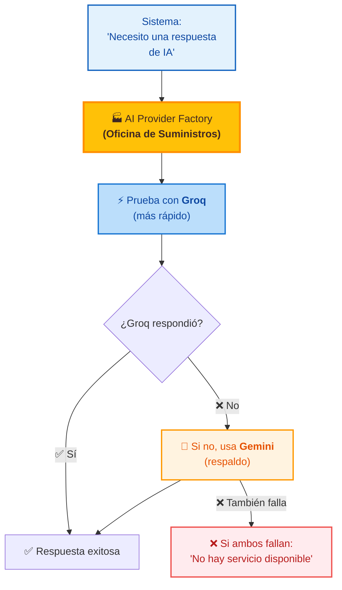

### 8.4. Proxy — "El Recepcionista" 🚪

**Problema:** El Frontend está en Vercel y el Backend en Render. Tienen direcciones diferentes.

**Solución:** Un **recepcionista** (proxy) que recibe todas las solicitudes del Frontend y las redirige al Backend.

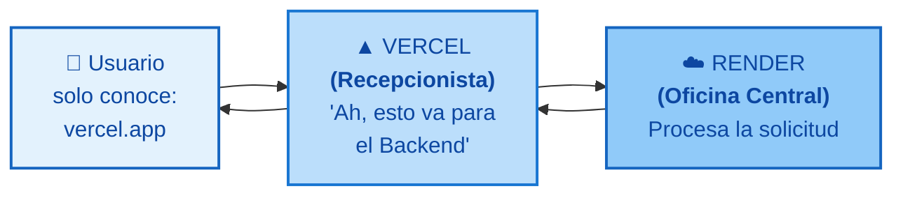

**Analogía:** Llamás a la universidad. El recepcionista atiende y te pasa al departamento correcto. Vos no necesitás saber el número interno de cada oficina.

### 8.5. Observador (SSE) — "El Altavoz de Notificaciones" 🔊

**Problema:** Cuando un profesor publica notas, el estudiante tiene que estar refrescando la página todo el día para ver si ya están.

**Solución:** Un **altavoz** que avisa automáticamente cuando hay novedades.

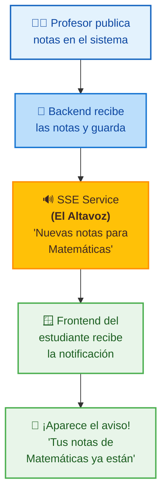

**Analogía:** Es como estar suscrito a un canal de WhatsApp. No necesitás preguntar "¿hay novedades?" cada 5 minutos. Cuando hay algo, te llega solo.

### 8.6. Retry + Exponential Backoff — "Volvé Más Tarde" ⏱️

**Problema:** A veces el Backend está ocupado y no responde.

**Solución:** Intentar de nuevo, pero esperando cada vez más tiempo.

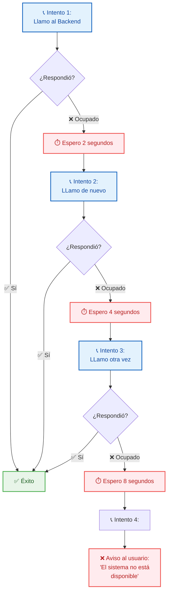

**Por qué es importante:** Si todos los usuarios reintentan al mismo tiempo cada 1 segundo, saturan el sistema. Si esperan cada vez más (2, 4, 8 segundos), el sistema tiene tiempo de recuperarse solo.

### 8.7. Planificador (Scheduler) — "El Despertador" ⏰

**Problema:** Hay tareas que tienen que pasar automáticamente en determinados horarios (enviar recordatorios, hacer respaldos).

**Solución:** Un **despertador** programado que ejecuta tareas solitas.

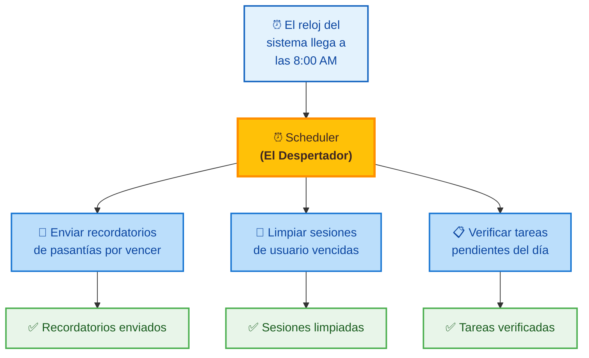

**Analogía:** Como poner una alarma en el celular para que te recuerde algo. No necesitás estar pendiente — la alarma suena sola.

---

## 9. Seguridad: Candados y Guardias

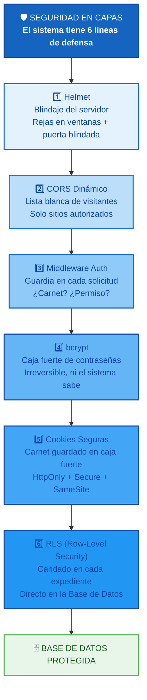

### 9.1. Primera línea: Helmet 🛡️

**¿Qué es?** Helmet es un paquete de seguridad que configura el Backend para resistir ataques comunes. Es como poner rejas en las ventanas y una puerta blindada.

**Algunas cosas que hace:**
- Configura **CSP** (Content Security Policy): le dice al navegador "solo podés cargar recursos de estos sitios de confianza". Así, si alguien intenta injectar código malicioso, el navegador lo bloquea.
- Oculta información del servidor: no le dice a los atacantes qué tecnología usamos

### 9.2. Segunda línea: CORS Dinámico 🌐

**¿Qué es?** CORS es una regla que dice "estos sitios web pueden hablar con nuestro Backend". Cualquier otro sitio queda afuera.

**Analogía:** Es como tener una lista blanca de visitantes. Solo los que están en la lista pueden entrar al edificio.

### 9.3. Tercera línea: Middleware de Autenticación 🪪

**¿Qué es?** Los guardias que vimos antes. Cada solicitud pasa por ellos:

```mermaid
flowchart TB
    classDef check fill:#E3F2FD,stroke:#1565C0,stroke-width:2px,color:#0D47A1
    classDef ok fill:#E8F5E9,stroke:#4CAF50,stroke-width:2px,color:#1B5E20
    classDef reject fill:#FFEBEE,stroke:#EF5350,stroke-width:2px,color:#B71C1C
    classDef pass fill:#E8F5E9,stroke:#4CAF50,stroke-width:3px,color:#1B5E20

    A["📨 Solicitud entrante"] --> B{"1️⃣ ¿Tiene carnet?"}
    B -->|"❌ No"| C["🚫 Rechazado"]
    B -->|"✅ Sí"| D{"2️⃣ ¿El carnet<br/>es válido?"}
    D -->|"❌ No"| C
    D -->|"✅ Sí"| E{"3️⃣ ¿El carnet<br/>no venció?"}
    E -->|"❌ Venció"| F["🔄 Pedir login<br/>de nuevo"]
    E -->|"✅ Vigente"| G{"4️⃣ ¿Tiene permiso<br/>para esto?"}
    G -->|"❌ No"| C
    G -->|"✅ Sí"| H["✅ TODO OK<br/>¡Adelante!"]

    class A check
    class B,D,E,G check
    class C,F reject
    class H pass
```

### 9.4. Cuarta línea: Contraseñas Protegidas 🔐

Las contraseñas no se guardan como texto plano. Se guardan con un algoritmo llamado **bcrypt**:
- `"mi_clave_123"` → se transforma en: `$2b$10$3E4k...un montón de caracteres...`
- Si alguien roba la base de datos, NO puede saber las contraseñas
- Ni siquiera el sistema sabe tu contraseña — solo sabe verificarla

**Analogía:** Es como una caja fuerte. Le ponés tu contraseña, la caja la transforma en un código secreto. Nadie puede abrir la caja, ni siquiera el que la fabricó, pero la caja sabe reconocer si la contraseña es correcta.

### 9.5. Quinta línea: Cookies Seguras 🍪

El carnet digital (JWT) se guarda en una **cookie** especial con estas características:

```mermaid
flowchart LR
    classDef cookie fill:#FFF3E0,stroke:#FF9800,stroke-width:2px,color:#E65100
    classDef feature fill:#E3F2FD,stroke:#1565C0,stroke-width:2px,color:#0D47A1
    classDef result fill:#E8F5E9,stroke:#4CAF50,stroke-width:2px,color:#1B5E20

    A["🍪 Cookie del JWT"]
    B["🔒 HttpOnly<br/>JavaScript no puede<br/>tocar la cookie"]
    C["🔒 Secure<br/>Solo se envía por<br/>HTTPS encriptado"]
    D["🔒 SameSite<br/>No se envía si viene<br/>de otro sitio web"]
    E["✅ Triple protección<br/>contra robos de sesión"]

    A --> B
    A --> C
    A --> D
    B --> E
    C --> E
    D --> E

    class A cookie
    class B,C,D feature
    class E result
```

### 9.6. Sexta línea: RLS — Candado en la Base de Datos 🔒

**¿Qué es?** Row-Level Security (RLS) es una característica de PostgreSQL que permite controlar QUIÉN puede ver QUÉ filas de cada tabla.

**Analogía:** En el archivo de la universidad, hay expedientes de estudiantes, profesores y personal administrativo. Con RLS:

```mermaid
flowchart TB
    classDef student fill:#E3F2FD,stroke:#1565C0,stroke-width:2px,color:#0D47A1
    classDef prof fill:#BBDEFB,stroke:#1976D2,stroke-width:2px,color:#0D47A1
    classDef admin fill:#FFC107,stroke:#FF8F00,stroke-width:2px,color:#3E2723
    classDef db fill:#90CAF9,stroke:#1565C0,stroke-width:2px,color:#0D47A1

    A["🧑 Estudiante<br/>busca en el archivo..."]
    B["👨‍🏫 Profesor<br/>busca en el archivo..."]
    C["👔 Administrador<br/>busca en el archivo..."]
    D["🗄️ ARCHIVO CENTRAL<br/>con RLS activado"]
    E["📄 Ve SOLO su<br/>propio expediente"]
    F["📄 Ve expedientes<br/>de SUS estudiantes"]
    G["📄 Ve TODO<br/>sin restricciones"]

    A --> D --> E
    B --> D --> F
    C --> D --> G

    class A student
    class B prof
    class C admin
    class D db
    class E student
    class F prof
    class G admin
```

Incluso si alguien lograra saltarse el Backend, la base de datos lo rechazaría igual porque el candado está directamente en el archivero.

### 9.7. Monitoreo y Límites 📊

- **Rate limiting**: Si alguien hace demasiadas solicitudes muy rápido (como un ataque), el sistema lo frena temporalmente
- **Logs**: Cada acción importante se registra. Si algo pasa mal, hay un rastro de quién hizo qué
- **Alertas**: El sistema notifica cuando algo anda mal

---

## 10. Glosario Visual Rápido

| Término | Analogía | ¿Qué hace? |
|---------|----------|------------|
| **API** | Formulario oficial | Es el formato en que el Frontend y Backend se envían datos |
| **JWT** | Carnet universitario | Identifica al usuario y sus permisos sin necesidad de consultar la base cada vez |
| **Middleware** | Guardia de seguridad | Intercepta solicitudes para verificar permisos, validar datos, etc. |
| **Controller** | Jefe de departamento | Recibe solicitudes y decide qué acción tomar |
| **Service** | Especialista | Ejecuta la lógica de negocio (calcular, buscar, guardar) |
| **Router** | Mensajero interno | Dirige las solicitudes a la oficina (controller) correcta |
| **Base de datos** | Archivo central | Guarda toda la información del sistema |
| **PostgreSQL** | Sistema de archivo profesional | Motor de base de datos confiable y rápido |
| **Singleton** | Única fotocopiadora | Una sola instancia compartida de un recurso |
| **Factory** | Oficina de suministros | Crea el objeto adecuado según lo que se necesite |
| **Adapter/Strategy** | Traductor | Permite cambiar entre Supabase (online) y PGlite (offline) sin modificar el resto |
| **Proxy** | Recepcionista | Redirige solicitudes del Frontend al Backend |
| **SSE** | Altavoz | Envía notificaciones en tiempo real del Backend al Frontend |
| **Cron/Scheduler** | Despertador automático | Ejecuta tareas programadas (respaldos, recordatorios) |
| **Retry/Backoff** | "Volvé más tarde" | Reintenta con espera creciente cuando algo falla |
| **CDN** | Red de fotocopias mundiales | Distribuye el Frontend por el mundo para que cargue rápido |
| **Docker** | Contenedor portátil | Empaqueta todo el sistema para ejecutarlo en cualquier PC |
| **PGlite** | Archivo local de bolsillo | Base de datos PostgreSQL en miniatura para usar sin internet |
| **Helmet** | Blindaje del servidor | Configura seguridad contra ataques comunes |
| **CORS** | Lista blanca de visitantes | Solo permite conexiones desde sitios autorizados |
| **bcrypt** | Caja fuerte de contraseñas | Guarda contraseñas de forma irreversible |
| **RLS** | Candado en cada expediente | Controla quién puede ver cada fila de la base de datos |

---

## 🎯 Resumen Final: El Sistema en 3 Ideas

```mermaid
flowchart TB
    classDef idea1 fill:#1565C0,color:#ffffff,stroke:#0D47A1,stroke-width:2px
    classDef idea2 fill:#1976D2,color:#ffffff,stroke:#0D47A1,stroke-width:2px
    classDef idea3 fill:#2196F3,color:#ffffff,stroke:#0D47A1,stroke-width:2px

    A["💡 1. TRES PARTES SEPARADAS<br/>Frontend (lo que ves)<br/>Backend (lo que procesa)<br/>Base de Datos (lo que guarda)<br/>Como: ventanilla, oficina y archivo"]
    B["💡 2. CADA CLIC ES UN VIAJE<br/>Tocás un botón → viaja a la oficina<br/>→ procesa → busca en el archivo
    → vuelve con el resultado<br/>Todo en fracciones de segundo"]
    C["💡 3. CONFIABLE Y SEGURO<br/>Múltiples capas de seguridad<br/>Funciona sin internet (app escritorio)<br/>Maneja errores sin romperse"]

    A --> B --> C

    class A idea1
    class B idea2
    class C idea3
```

---

> **📝 Nota:** Este documento está pensado como guía de estudio y apoyo visual para la exposición. Todos los diagramas usan Mermaid (renderizable en GitHub, VS Code con extensión Mermaid, o herramientas online como mermaid.live). Para ver la versión técnica completa (con referencias de código), consultar `ARQUITECTURA_DEL_SISTEMA.md`.
