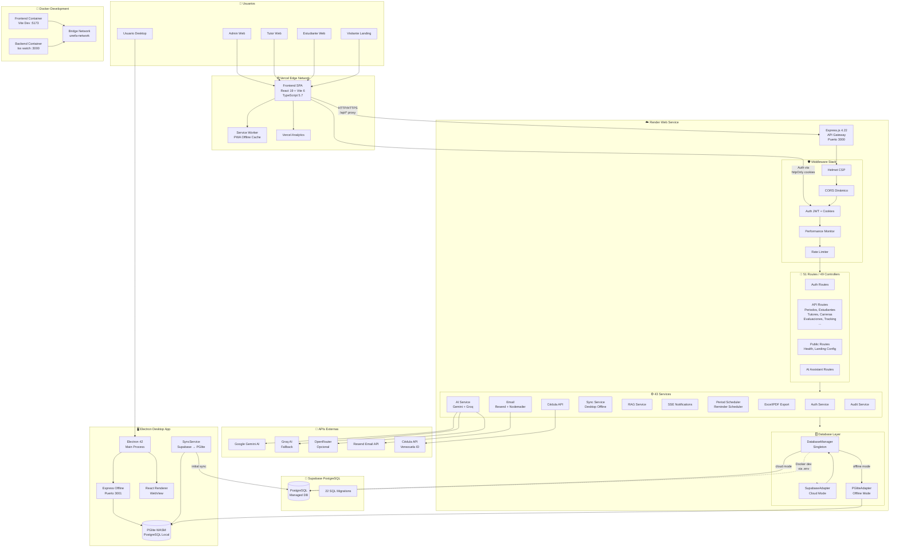
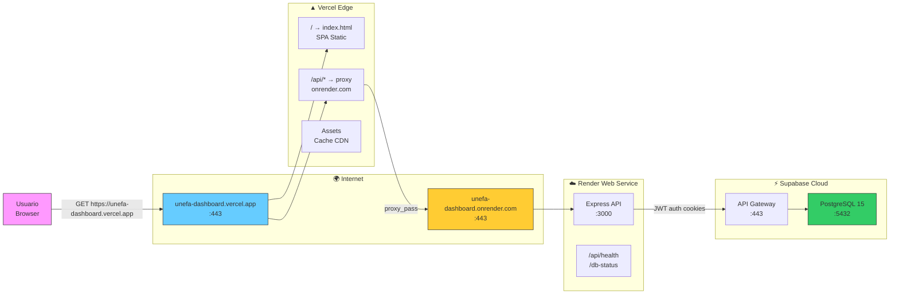

# Diagrama de Despliegue — UNEFA Dashboard v2.2.0

> **Arquitectura de despliegue actual del sistema SIGP UNEFA Dashboard**

---

## 1. Diagrama General (C4 — Nivel Contenedor)



---

## 2. Diagrama de Red y Puertos



---

## 3. Stack Tecnológico por Capa

### 3.1 Frontend (Vercel)

| Componente | Tecnología | Versión |
|-----------|-----------|---------|
| Framework UI | React | 19.0.0 |
| Bundler | Vite | 6.1.0 |
| Lenguaje | TypeScript | 5.7.2 |
| Estilos | Tailwind CSS | 4.1.18 |
| Routing | React Router | 7.1.5 |
| Forms | React Hook Form + Zod | 7.69.0 / 4.3.6 |
| HTTP | Axios | 1.13.2 |
| PWAs | vite-plugin-pwa | 1.3.0 |
| Analytics | @vercel/analytics | 1.6.1 |
| Testing | Vitest + Playwright | 4.0.16 / 1.58.2 |
| Storybook | Storybook | 8.0.0 |

### 3.2 Backend (Render)

| Componente | Tecnología | Versión |
|-----------|-----------|---------|
| Runtime | Node.js | >= 18.x |
| Framework | Express.js | 4.21.2 |
| Lenguaje | TypeScript | 5.7.2 |
| DB Cliente | Supabase JS + Prisma | 2.90.1 / 7.5.0 |
| Auth | JWT + Bcrypt + Cookies | — |
| Seguridad | Helmet + CORS | 8.0.0+ |
| Email | Resend + Nodemailer | 6.12.4+ |
| AI | Google Gemini (primary), Groq (fallback) | — |
| File Upload | Multer | 2.0.2 |

### 3.3 Desktop (Electron)

| Componente | Tecnología | Versión |
|-----------|-----------|---------|
| Shell | Electron | 42.3.0 |
| DB Local | PGlite (PostgreSQL WASM) | 0.4.6 |
| Builder | electron-builder | 26.8.1 |
| Instalador | NSIS (Windows) | — |

### 3.4 Infraestructura

| Componente | Proveedor | Detalle |
|-----------|-----------|---------|
| Frontend Host | Vercel | SPA + CDN + PWA |
| Backend Host | Render | Web Service Node |
| Database | Supabase | PostgreSQL managed |
| CI/CD | GitHub Actions | Build + test + deploy |
| Container | Docker Compose | Desarrollo multi-stage |
| Email | Resend | Transaccional |

---

## 4. Flujo de Request (Producción)

```
Browser
  │
  ├─ HTTPS ──► Vercel Edge Network
  │              │
  │              ├─ GET /             → index.html (SPA)
  │              ├─ GET /dashboard    → index.html (SPA, client routing)
  │              ├─ /assets/*        → Cache CDN (js, css, png, svg)
  │              │
  │              └─ /api/*           → Proxy Rewrite
  │                                    ↓
  │                              Render Web Service
  │                                    │
  │                                    ├─ /api/health            → 200
  │                                    ├─ /api/auth/*            → Auth Controller
  │                                    ├─ /api/periodos/*        → Periods Controller
  │                                    ├─ /api/students/*        → Students Controller
  │                                    ├─ ... (51 routes)
  │                                    │
  │                                    ├─ Middleware stack
  │                                    │   ├─ Helmet (CSP)
  │                                    │   ├─ CORS (dynamic origin)
  │                                    │   ├─ Auth JWT (cookie-based)
  │                                    │   └─ Rate limiting
  │                                    │
  │                                    └─ DatabaseManager
  │                                         └─ SupabaseClient
  │                                              └─ PostgreSQL (via REST)
  │
  └─ WebSocket ◄── SSE /api/notifications/stream (solo modo tradicional)
```

---

## 5. Modos de Operación

### 5.1 Modo Cloud (Producción / Desarrollo online)

```
Frontend (Vercel) ───► Backend (Render) ───► Supabase PostgreSQL
```

- Sesiones con cookies httpOnly + JWT
- Refresh automático de sesión (auto-refresh interceptor)
- Notificaciones en tiempo real vía SSE
- Schedulers de periodo y recordatorios

### 5.2 Modo Offline (Desktop Electron)

```
React (WebView) ◄──► Express Offline (:3001) ◄──► PGlite WASM
                                              ▲
                                              │ SyncService
                                              │ (al iniciar)
                                              ▼
                                        Supabase PostgreSQL
```

- PGliteAdapter traduce queries estilo Supabase a SQL parametrizado
- SyncService sincroniza datos desde Supabase al iniciar
- Controllers no cambian: usan `dbManager.getConnection()`
- Password por defecto: admin123 (desarrollo)
- Sin SSE, sin schedulers

### 5.3 Modo Docker (Desarrollo local)

```
docker-compose up --build
  ├─ Frontend Container (:5173) ←→ Backend Container (:3000)
  └─ Ambos en unefa-network (bridge)
```

- `.env` montado como solo lectura (`:ro`)
- Healthchecks periódicos de integridad
- Hot Module Replacement (HMR)

---

## 6. Migraciones y Base de Datos

| # | Migration | Descripción |
|---|-----------|-------------|
| 001 | `create_persons` | Tabla unificada de personas |
| 002 | `migrate_persons_data` | Migración de datos existentes |
| 003 | `add_person_fks` | Foreign keys de persona |
| 004 | `add_remaining_person_fks` | FKs restantes |
| 004b | `add_person_fk_triggers` | Triggers de integridad |
| 005 | `permissions_module` | Módulo de permisos |
| 006 | `reports_module` | Reportes |
| 007 | `prospect_lists` | Listas de prospectos |
| 008 | `comite_member_index` | Índices de comité |
| 009 | `email_templates` | Plantillas de email |
| 010 | `knowledge_base` | Base de conocimiento RAG |
| 011 | `add_grace_days` | Días de gracia |
| 012 | `create_academic_config` | Configuración académica |
| 013 | `add_period_validation_config` | Validación de periodos |
| 014 | `seed_transfer` / `text_normalization` | Datos semilla + normalización |
| 015 | `system_institution` | Institución del sistema |
| V002–V005 | Varios | Performance indexes, RPCs, titles |

---

## 7. Variables de Entorno Críticas

### Frontend (.env raíz)

```
VITE_API_URL=http://localhost:3000/api
VITE_SUPABASE_URL=https://your-project.supabase.co
VITE_SUPABASE_ANON_KEY=your-anon-key
VITE_GOOGLE_AI_KEY=your-google-ai-key
VITE_OPENROUTER_KEY=
GROQ_API_KEY=your-groq-api-key
```

### Backend (backend/.env)

```
SUPABASE_URL=https://your-project.supabase.co
SUPABASE_SERVICE_ROLE_KEY=your-service-role-key
JWT_SECRET=your-jwt-secret
PORT=3000
NODE_ENV=development
FRONTEND_URL=http://localhost:5173
RESEND_API_KEY=your-resend-key
GOOGLE_AI_KEY=your-google-key
GROQ_API_KEY=your-groq-key
CEDULA_APP_ID=your-cedula-app-id
CEDULA_TOKEN=your-cedula-token
DATABASE_URL="file:./dev.db"
```

---

## 8. Seguridad

- **CSP estricto**: Helmet con directivas específicas para CartoDB, OSM, ArcGIS, Google Fonts
- **CORS dinámico**: Lista blanca desde `ALLOWED_ORIGINS` env var
- **Cookies httpOnly**: Sesión JWT no accesible desde JavaScript
- **Auto-refresh de sesión**: Renovación silenciosa ante 401
- **Rate limiting**: Middleware de límite por IP
- **Docker .env readonly**: Archivos montados como `:ro` + verificación MD5
- **Sanitización de queries**: PGliteAdapter usa SQL parametrizado
- **Error handler global**: Captura y normaliza errores

---

## 9. Monitoreo

- **Health endpoint**: `/api/health` con estado de DB + latencia
- **DB Status endpoint**: `/api/db-status` para verificación de conexión
- **Performance middleware**: Mide latencia de requests
- **Request logging**: Log de método + URL + origin
- **Error logging**: Console con niveles (error/warn)
- **Vercel Analytics**: Analítica de uso en frontend
- **Audit service**: Registro de operaciones críticas

---

## 10. URLs de Producción

| Recurso | URL |
|---------|-----|
| Frontend (Vercel) | `https://unefa-dashboard.vercel.app` |
| Backend (Render) | `https://unefa-dashboard.onrender.com` |
| API Health | `https://unefa-dashboard.onrender.com/api/health` |
| Supabase Dashboard | Panel de Supabase (privado) |
| Repositorio | `https://github.com/Antony-Figueroa/UNEFA_DASHBOARD` |

---

> **Nota**: Las URLs de producción pueden variar según la configuración actual del proyecto.
> Verificar en `vercel.json` y `Render Dashboard` para las URLs activas.
