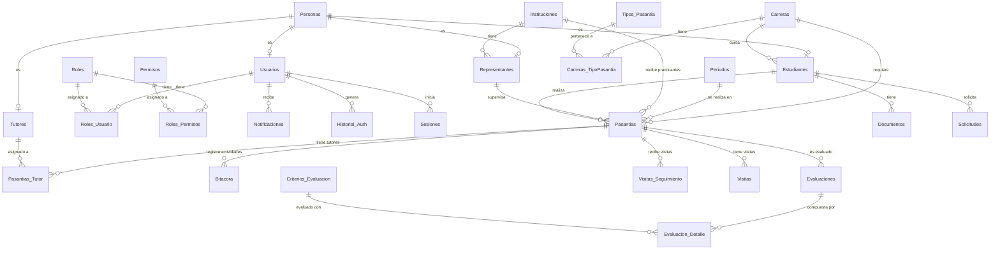
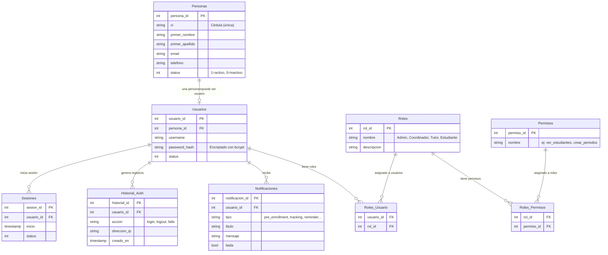
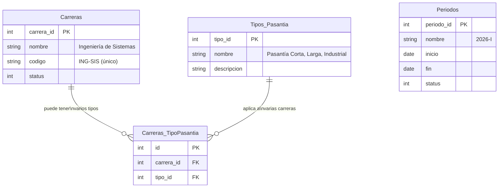
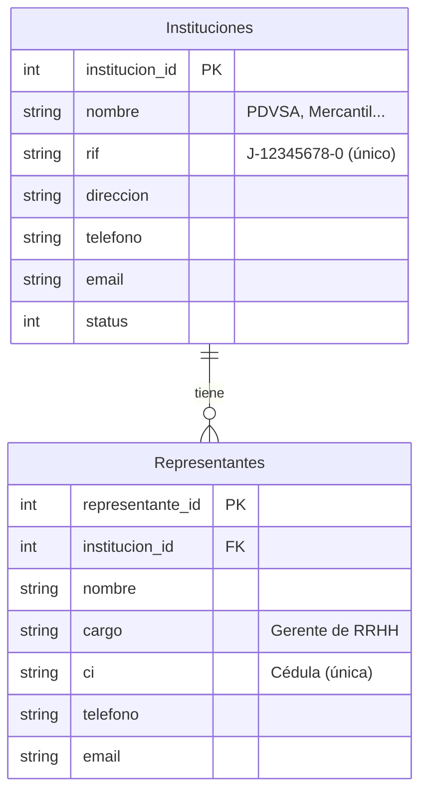
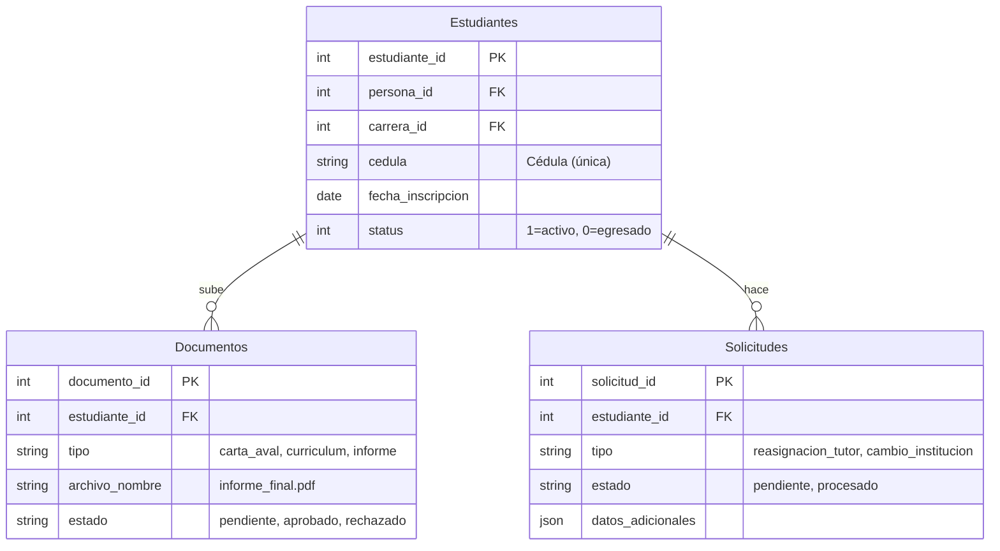
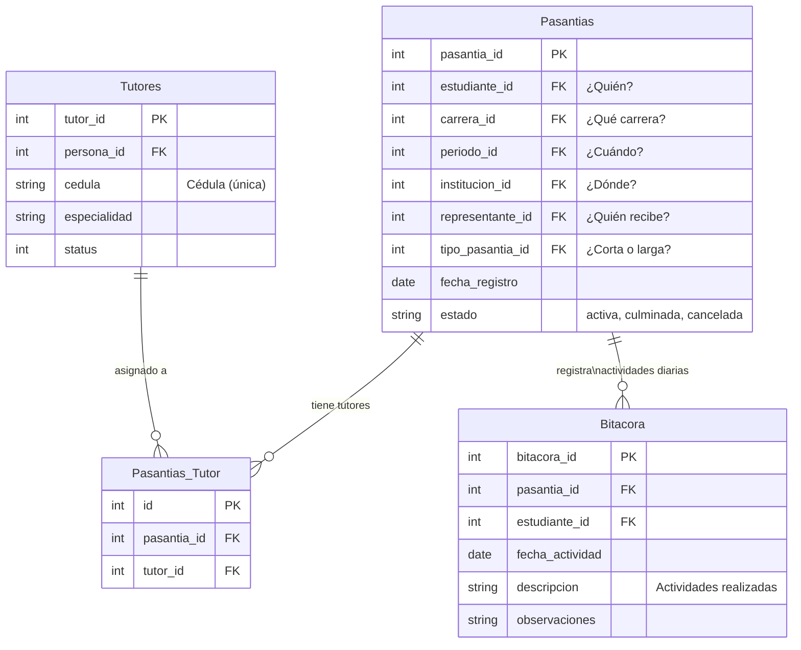
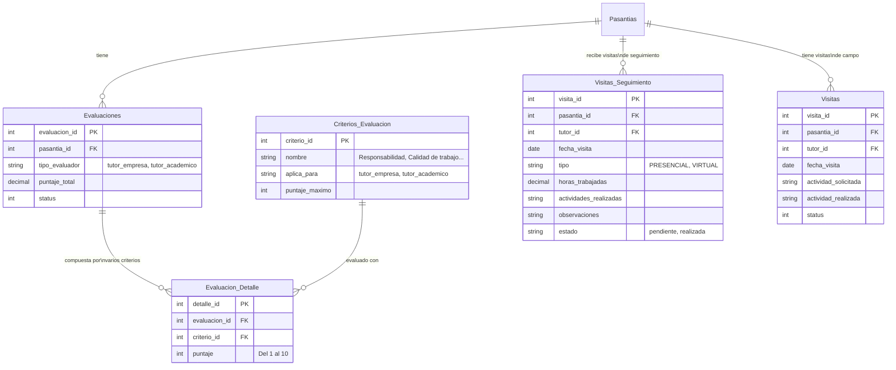
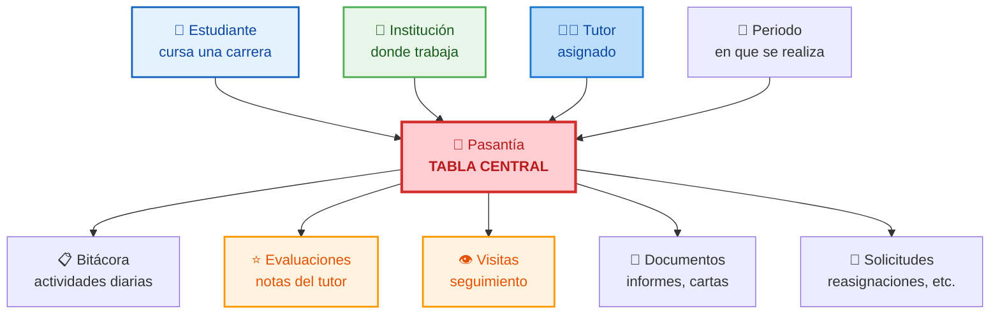
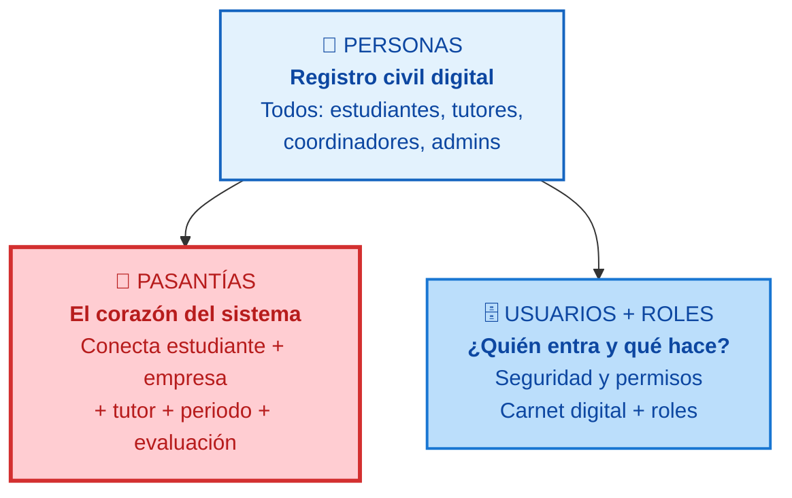

# 🗄️ Modelo Entidad-Relación — UNEFA Dashboard

> **Diagramas del modelo de datos** explicados para la exposición
> Las tablas reales tienen el prefijo `t_` (ej: `t_students`). Acá usamos nombres legibles.

---

## 📊 Mapa General de Datos

El sistema tiene **69 tablas** en total. Este diagrama muestra las ~25 entidades principales organizadas por dominio funcional.



---

## 1. 🔵 Dominio: Seguridad y Acceso

Son las tablas que controlan **quién entra al sistema** y **qué puede hacer**.



### ¿Cómo se relacionan?

**Analogía universitaria:**
- **Personas** es el registro civil de la universidad: todas las personas que tienen relación con la institución
- **Usuarios** son los que tienen carnet para entrar al sistema digital
- **Roles** definen si sos estudiante, profesor, coordinador o admin
- **Permisos** son autorizaciones específicas: "María tiene rol Coordinadora, y como coordinadora puede ver estudiantes, crear periodos, pero no borrar backups"
- **Notificaciones** son los avisos que le llegan a cada usuario
- **Historial_Auth** registra cada vez que alguien entra o intenta entrar (como el libro de visitas de la prefectura)

> 💡 **Para la expo:** Mostrá que UNA persona puede tener varios roles (un profesor que también es tutor), y que los permisos no se asignan a cada usuario uno por uno — se asignan al ROL, y el usuario hereda los permisos de su rol.

---

## 2. 🟢 Dominio: Académico

Carreras, periodos y tipos de pasantía — la **estructura académica** de la universidad.



### ¿Cómo se relacionan?

**Analogía:** Cada carrera (Ing. Sistemas, Administración) puede tener varios tipos de pasantía (corta, larga, industrial). Es como un catálogo: cada carrera elige qué tipos de pasantía ofrece. La tabla `Carreras_TipoPasantia` es la "lista de opciones" que conecta ambas.

Los **Periodos** definen las ventanas de tiempo (2026-I, 2026-II) en las que se realizan las pasantías.

---

## 3. 🟠 Dominio: Instituciones

Las **empresas y organizaciones** donde los estudiantes hacen sus pasantías.



### ¿Cómo se relacionan?

**Analogía:** Cada institución (empresa) tiene uno o varios representantes. El representante es la persona que firma los convenios, recibe a los pasantes y coordina con la universidad. Una institución SIN representante no puede recibir pasantes.

> 💡 **Para la expo:** Preguntá "¿En sus pasantías, quién los recibía en la empresa?" — Ese es el representante. Y la empresa es la institución.

---

## 4. 🔴 Dominio: Pasantías — El Corazón del Sistema

Este es el **núcleo** de todo el sistema. Todo gira alrededor de las pasantías.

### 4.1. Estudiantes y su relación con pasantías



### 4.2. Pasantías — La tabla central



### 4.3. Evaluaciones y Visitas



### ¿Cómo se relaciona todo?



### El viaje completo de una pasantía:

```
1. Un ESTUDIANTE está cursando una CARRERA
         ↓
2. Llega el PERIODO de pasantías
         ↓
3. El estudiante busca una INSTITUCIÓN (empresa)
         ↓
4. La institución asigna un REPRESENTANTE que lo recibe
         ↓
5. Se REGISTRA la PASANTÍA (tabla central)
         ↓
6. Se asigna un TUTOR académico (pueden ser varios)
         ↓
7. Durante la pasantía:
   ├── El estudiante registra BITÁCORA (actividades diarias)
   ├── El tutor hace VISITAS de seguimiento
   ├── Se suben DOCUMENTOS (informes, cartas)
   └── El estudiante puede hacer SOLICITUDES (cambios)
         ↓
8. Al finalizar: EVALUACIÓN
   ├── Evalúa el tutor de la empresa
   ├── Evalúa el tutor académico
   └── Cada evaluación tiene CRITERIOS con puntajes
         ↓
9. La pasantía se MARCA como culminada ✅
```

> 💡 **Para la expo:** Este flujo es perfecto para contarlo como una historia. El público sigue naturalmente: estudiante → busca empresa → hace pasantía → lo evalúan. Es la vida real de cualquier pasante universitario.

---

## 5. 📋 Tablas de Soporte (Sistema y Configuración)

Además de las tablas principales, el sistema tiene tablas de **soporte técnico**:

| Tabla | ¿Qué guarda? | Analogía |
|-------|-------------|----------|
| `t_config` | Configuración general del sistema | El manual de normas de la universidad |
| `t_academic_config` | Días de gracia, validaciones de periodo | El calendario académico |
| `t_landing_config` | Contenido de la página principal (landing) | La cartelera de la entrada |
| `t_backups` | Historial de respaldos de la base de datos | Las copias de seguridad del archivo |
| `t_list` / `t_value_list` | Listas desplegables (tipos, categorías) | Los formularios con opciones pre-cargadas |
| `t_change_log` | Registro de cambios en datos importantes | El libro de actas: quién cambió qué y cuándo |
| `t_chat_sessions` | Conversaciones del asistente IA | El historial del chatbot |
| `t_prospect_lists` / `t_prospect_list_items` | Listas de prospectos (postulantes) | La lista de aspirantes a ingresar |
| `t_system_institution` | Datos de la universidad (UNEFA) | La información institucional |

---

## 🎯 Resumen: El Sistema en 3 Tablas Clave

Si tenés que explicar el modelo de datos en 3 minutos, mostrá estas 3 tablas:



---

> **📝 Nota:** Los nombres de tablas reales usan el prefijo `t_` y mayúsculas (ej: `t_professional_practices`). Acá se simplificaron para hacerlos más legibles. El sistema tiene 69 tablas en total; este documento cubre las ~25 entidades principales.
