# 🗄️ Modelo Entidad-Relación — UNEFA Dashboard

> **Diagrama de clases UML** del modelo de datos
> Nombres reales de tablas (`t_*`) y columnas, tipos PostgreSQL, relaciones explícitas con FK.

---

## 1. Diagrama General (Vista de Alto Nivel)

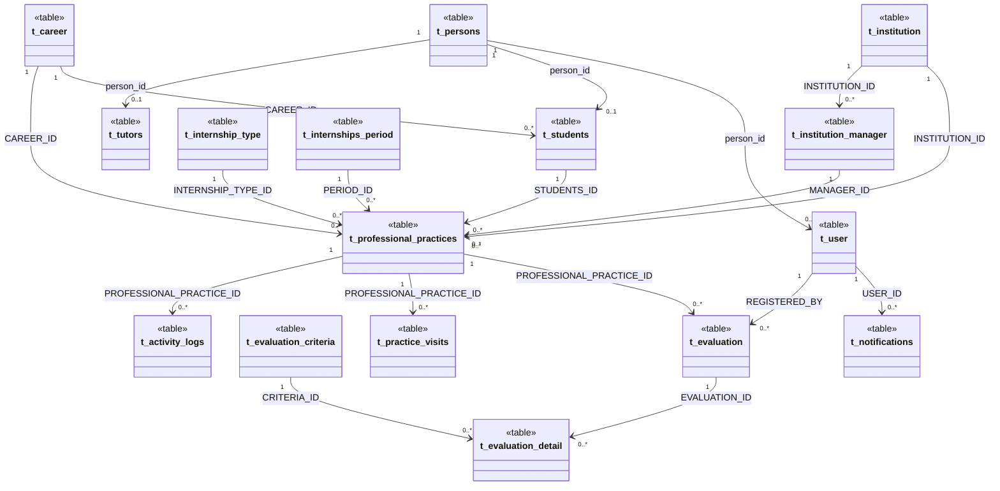

---

## 2. 🔵 Dominio: Personas, Usuarios y Seguridad

### 2.1. t_persons — Registro Unificado de Personas

Tabla base: toda persona física en el sistema (estudiantes, tutores, usuarios, representantes).

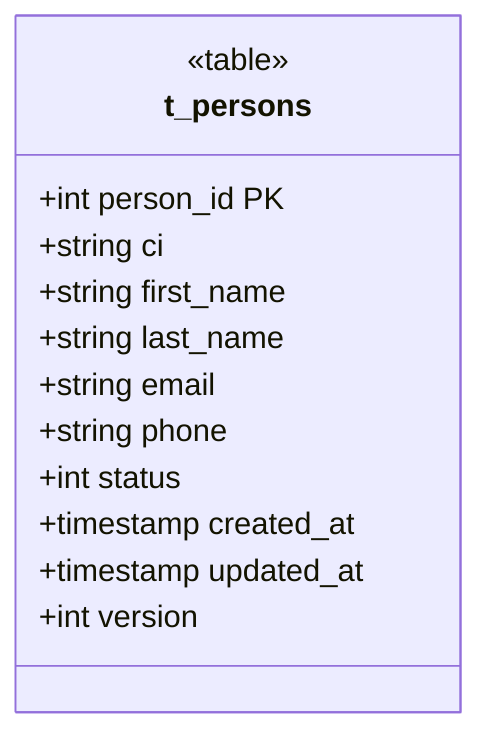

### 2.2. t_user — Usuarios del Sistema

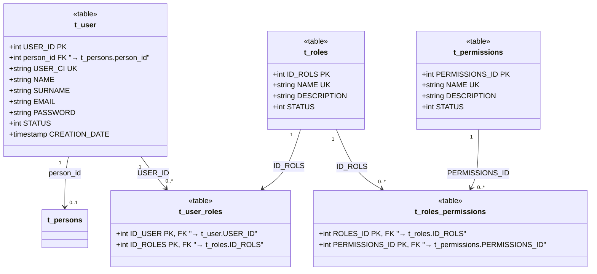

### 2.3. Sesiones, Autenticación y Notificaciones

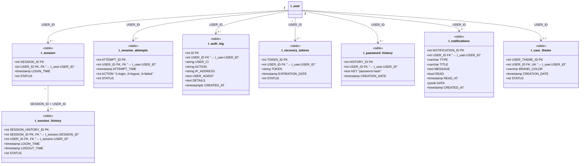

### 2.4. Preguntas de Seguridad

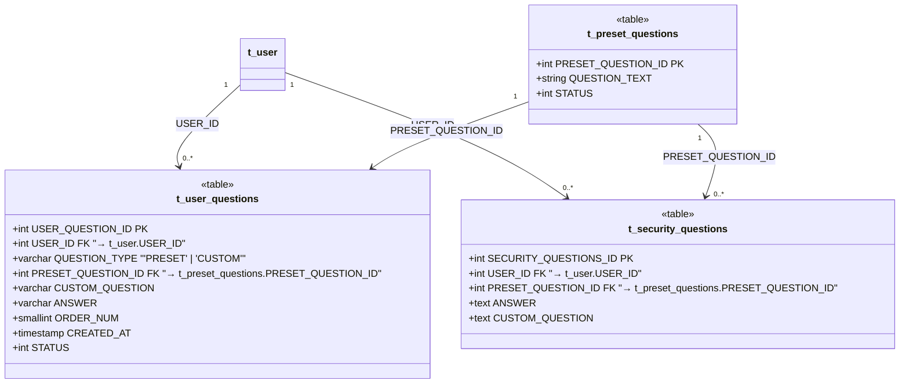

---

## 3. 🟢 Dominio: Académico

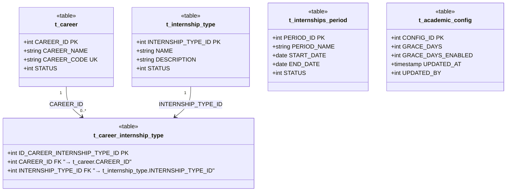

---

## 4. 🟠 Dominio: Instituciones

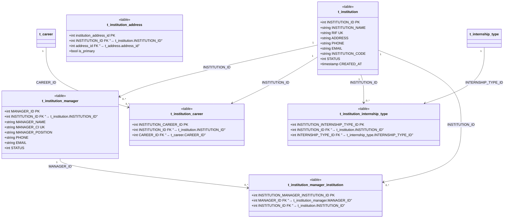

---

## 5. 🔴 Dominio: Pasantías — El Corazón del Sistema

### 5.1. Estudiantes y Tutores

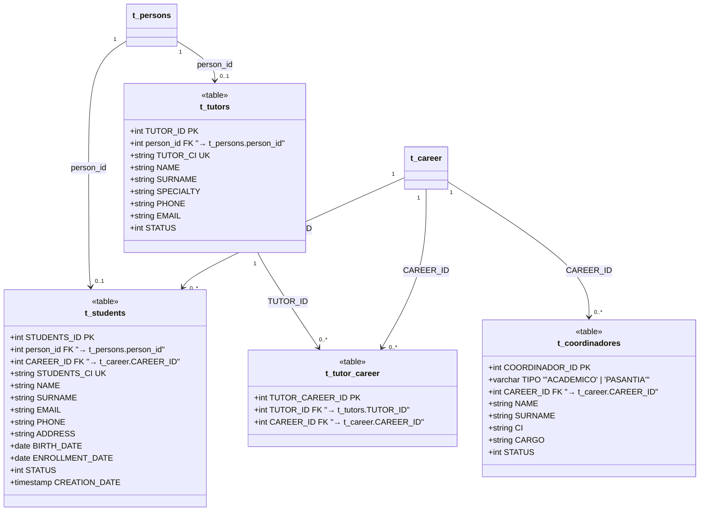

### 5.2. Tabla Central — t_professional_practices

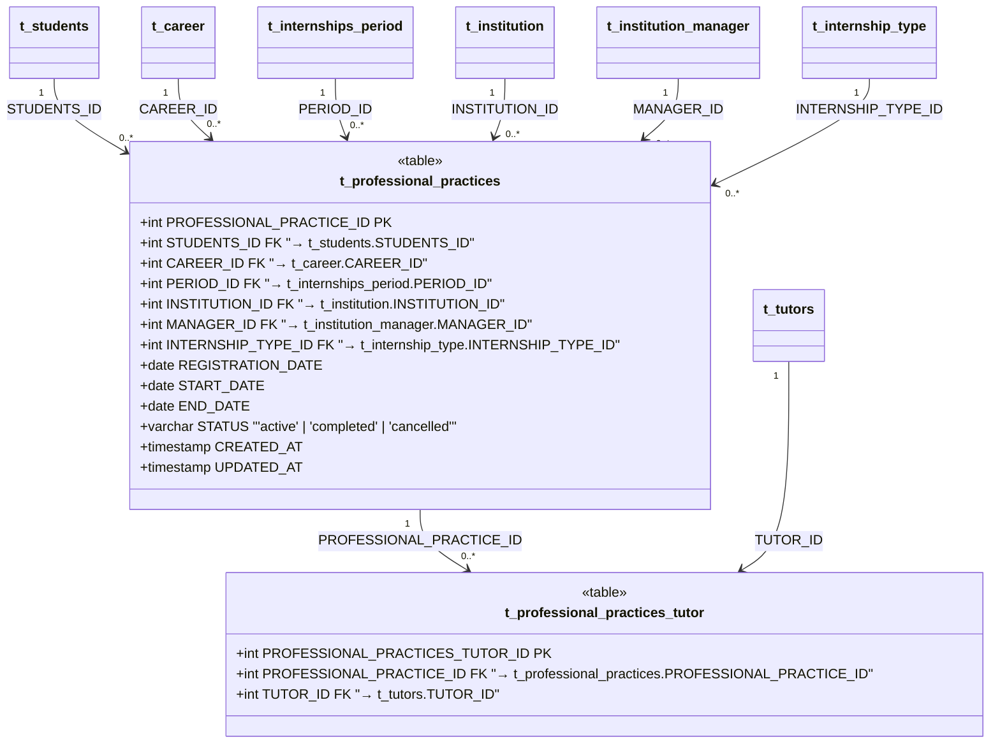

### 5.3. Evaluaciones

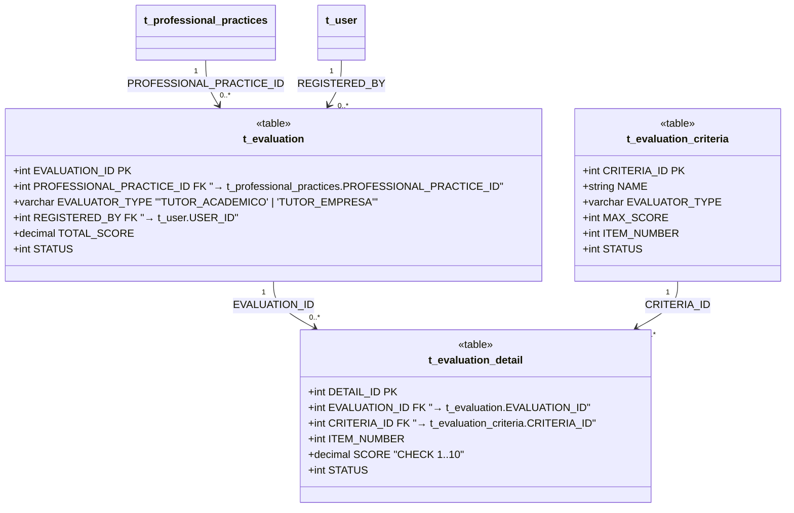

### 5.4. Visitas de Seguimiento

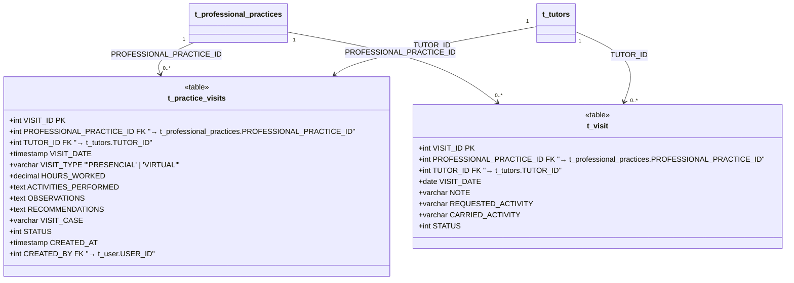

### 5.5. Bitácora, Documentos y Solicitudes

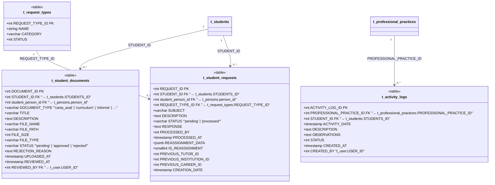

---

## 6. 📋 Tablas de Soporte

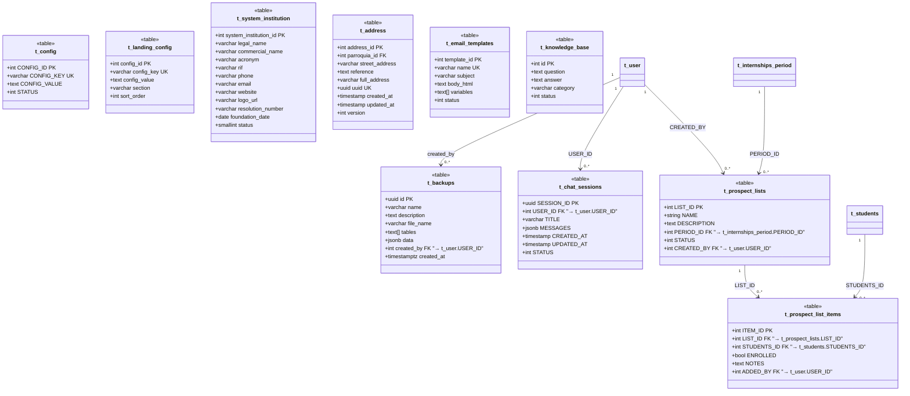

---

## 7. 📐 Resumen de Cardinalidades

| Relación | Tipo | Significado |
|----------|------|-------------|
| `1 → 0..1` | Uno a cero/uno | Una persona PUEDE ser usuario (pero no es obligatorio) |
| `1 → 0..*` | Uno a muchos | Una carrera TIENE muchos estudiantes (puede tener 0) |
| `1 → 1..*` | Uno a muchos (obligatorio) | Una evaluación TIENE al menos un detalle |
| `* → *` | Muchos a muchos | Roles ↔ Permisos (resuelto con tabla intermedia) |

**Reglas de oro del modelo:**
1. **t_persons** es la raíz — todo el mundo es primero una persona
2. **t_professional_practices** es la tabla más conectada (8 FK salientes)
3. Las relaciones muchos-a-muchos se resuelven con tablas intermedias (ej: `t_user_roles`, `t_roles_permissions`, `t_professional_practices_tutor`)
4. Los IDs son siempre `SERIAL` (autoincrementales) salvo excepciones como `uuid` en backups y chat

---

> **📝 Nota:** Las tablas reales tienen columnas adicionales de auditoría (`MODIF_USER_ID`, `MODIF_USER_DATE`, `ELIM_USER_ID`, `ELIM_USER_DATE`, `REST_USER_ID`, `REST_USER_DATE`) que se omitieron en estos diagramas por claridad. Se incluyeron todas las columnas de negocio relevantes.
